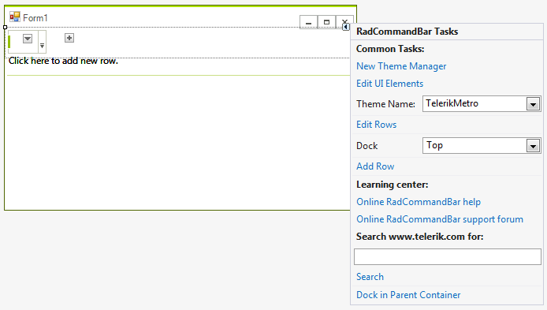
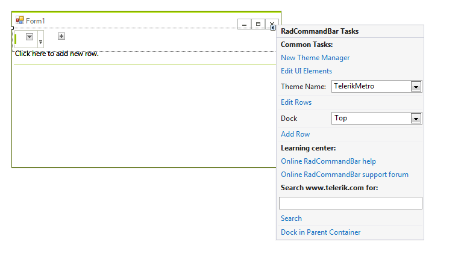
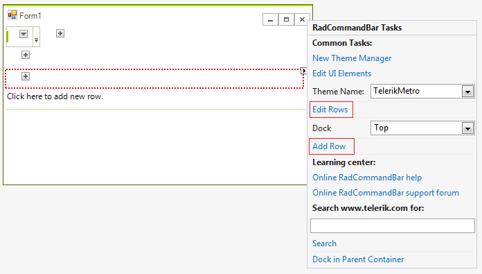
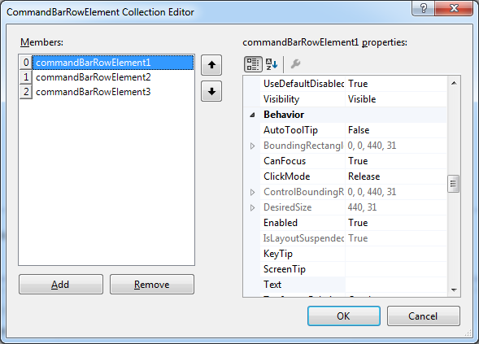
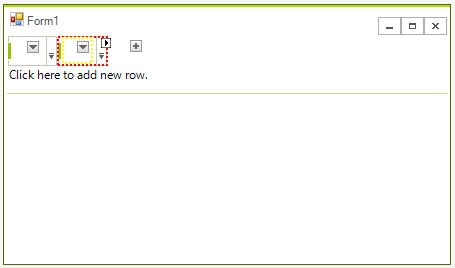
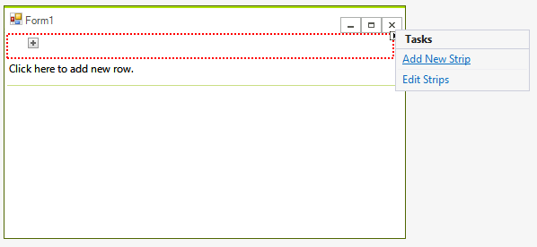
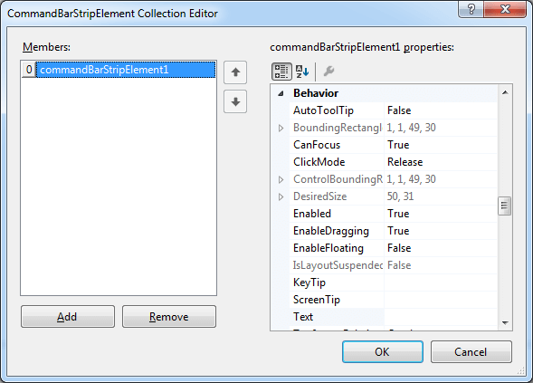
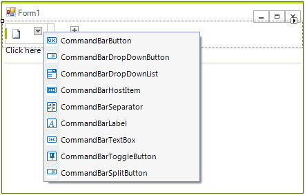
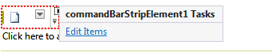
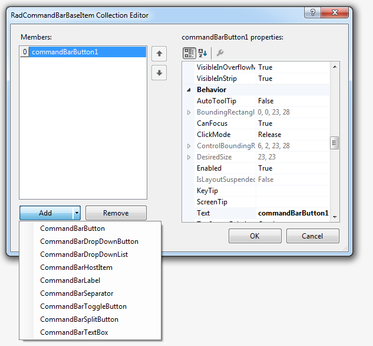

# Design-Time

To start using __RadCommandBar__ just drag it from the toolbox and drop it at the form.

## Smart Tag

Select __RadCommandBar__ and click the small arrow on the top right position in order to open the Smart Tag.

>caption Figure 1: Smart Tag

* __Common Tasks__

	* __New Theme Manager__: Adds a new __RadThemeManager__ component to the form.

	* __Edit UI elements__: Opens a dialog that displays the *Element Hierarchy Editor*. This editor lets you browse all the elements in the control.

	* __Theme Name__: Select a theme name from the drop down list of themes available for that control. Selecting a theme allows you to change all aspects of the controls visual style at one time.
	
	* __Edit Rows__: opens the *CommandBarRowElement Collection Editor*.
	
	* __Dock__: docks the control.
	
	* __AddRow__: adds a new row to the command bar.

* __Learning Center__: Navigate to the Telerik help, code library projects or support forum.

* __Search__: Search the Telerik site for a given string.

## Adding a Telerik RadCommandBar to a Form

To add a __RadCommandBar__ to a form, drag it from the toolbox and drop it on the form. By default, the control is oriented horizontally and docked to the top of the form. You can change the orientation, dock style and size from the property grid.

## Adding a RadCommandBarRowElement to RadCommandBarElement

To add a row element to a __RadCommandBarElement__, click in the blank area of the __RadCommandBar__ control, above the shaded band. You can repeat the process to create multiple rows.

Alternatively, follow these steps to edit line elements:

1. Select the __RadCommandBar__ control.

1. Open its __Smart Tag__ menu.

1. Select *Add Row* to immediately add a row or *Edit Rows* to open Collection Editor.

1. Click the *Add* button in the RadElement Collection Editor to add a new row element.

1. Click OK.

## Adding a RadCommandBarStripElement to a RadCommandBarRowElement

To add a strip element to a row element, click on the button marked with *+*.

Alternatively, follow these steps to edit strip elements:

* Select a __RadCommandBarRowElement__.

* Open its __Smart Tag__ menu.

* Select *Add New Strip* to immediately add a strip element or *Edit Strips* to open Collection Editor.

* Click the *Add* button in the RadElement Collection Editor to add a new strip element.

* Click OK.

## Adding an item to a RadCommandBarStripElement

To add an item to a strip element, click on the down arrow button, placed in the strip and choose the item type to add.

Alternatively, follow these steps to edit items:

1. Select a __RadCommandBarStripElement__.

1. Open its __Smart Tag__ menu.

1. Select *Edit Items* to open Collection Editor.

	

1. Click the *Add* button in the RadElement Collection Editor to add one of the possible items.

1. Click OK.

# See Also

* [Element Hierarchy Editor]()
* [Using default themes]()
