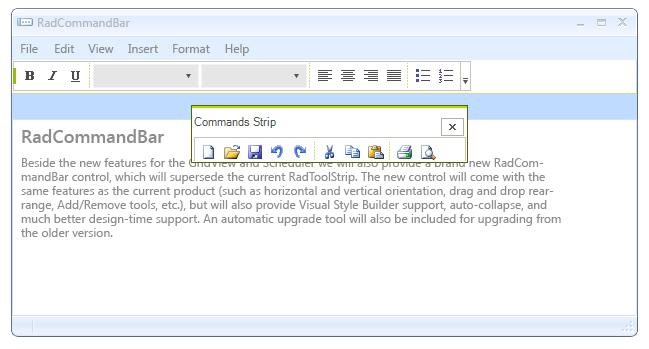

# Floating Strips
 
A __CommandBarStripElement__ object can be docked to the command bar or floated above the form. In addition, a __CommandBarStripElement__ can be dragged from the __RadCommandBar__ control that currently hosts it and docked to another.

## Basics

The ability of a __CommandBarStripElement__ object to float is controlled by the commandbar's __EnableDragging__ and __EnableFloating__ properties.  In order to allow a __CommandBarStripElement__ to float, both the __EnableDragging__ and __EnableFloating__ properties must be set to *true*. Setting only the __EnableFloating__ property to *true* has no effect on the floating behavior. The image below shows a __RadCommandBar__ with two strips one of which is floating:
 

A __CommandBarStrip__ element is made floating when it is dragged outside the area of its control. You can dock it again by moving it with mouse over any __RadCommandBar__ control.

## Events

There are some events that provide you with control over the floating/docking process.
       

* __FloatingStripCreating__ event is fired when a strip is about to be made floating. The following example shows how to prevent the strip “OptionsStrip” from becoming floating.
 	 

<snippet id='commandbar-floating-strips-floatingstripcreating-cs'/>
<snippet id='commandbar-floating-strips-floatingstripcreating-vb'/>

 
 

* __FloatingStripCreated__ event is fired when the floating form is shown.
  The following example shows how to set the caption text of the floating form: 
 
<snippet id='commandbar-floating-strips-floatingstripcreated-cs'/>
<snippet id='commandbar-floating-strips-floatingstripcreated-vb'/>

 
 

* __FloatingStripDocking__ event is fired when a floating strip is about to be docked to a __RadCommandBar__ control. 
The following example shows how to prevent the strip with name “OptionsStrip” from being docked. 
 
<snippet id='commandbar-floating-strips-floatingstripdocking-cs'/>
<snippet id='commandbar-floating-strips-floatingstripdocking-vb'/>

 
 

* __FloatingStripDocked__ event is fired when a floating strip has docked to a __RadCommandBar__ control.
 The following example shows a sample usage of this event.
   

<snippet id='commandbar-floating-strips-floatingstripdocked-cs'/>
<snippet id='commandbar-floating-strips-floatingstripdocked-vb'/>

 

