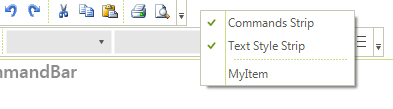

# Customize the control context menu

When the __RadCommandBar__ control is right clicked, a context menu enlisting the strips in the control together with __Customize__ menu option (allowing to customize the strips) is being shown. This context menu is being populated by the time of its opening and in order to customize its items, you should do that from within the __DropDownOpening__ event of this context menu. Here is how to subscribe to this event and how add your custom item and how to remove the __Customize__ option:
      
{{source=..\SamplesCS\CommandBar\SaveAndLoadLayout1.cs region=subscribeToContextMenuOpening}} 
{{source=..\SamplesVB\CommandBar\SaveAndLoadLayout.vb region=subscribeToContextMenuOpening}} 
````C#
radCommandBar1.CustomizeContextMenu.DropDownOpening += new CancelEventHandler(CustomizeContextMenu_DropDownOpening);

````
````VB.NET
AddHandler RadCommandBar1.CustomizeContextMenu.DropDownOpening, AddressOf CustomizeContextMenu_DropDownOpening

````

{{endregion}} 


{{source=..\SamplesCS\CommandBar\SaveAndLoadLayout1.cs region=CustomizeTheContextMenu}}  
{{source=..\SamplesVB\CommandBar\SaveAndLoadLayout.vb region=CustomizeTheContextMenu}} 

````C#
void CustomizeContextMenu_DropDownOpening(object sender, CancelEventArgs e)
{
    //add custom item
    RadMenuItem myItem = new RadMenuItem("MyItem");
    radCommandBar1.CustomizeContextMenu.Items.Add(myItem);
    //remove the customize menu option
    for (int i = 0; i < radCommandBar1.CustomizeContextMenu.Items.Count; i++)
			{
        if ( radCommandBar1.CustomizeContextMenu.Items[i].Text == "Customize...")
        {
            radCommandBar1.CustomizeContextMenu.Items.RemoveAt(i);
        }
    }
}

````
````VB.NET
Private Sub CustomizeContextMenu_DropDownOpening(sender As Object, e As System.ComponentModel.CancelEventArgs)
    'add custom item
    Dim myItem As New RadMenuItem("MyItem")
    RadCommandBar1.CustomizeContextMenu.Items.Add(myItem)
    'remove the customize menu option
    For i As Integer = 0 To RadCommandBar1.CustomizeContextMenu.Items.Count - 1
        If RadCommandBar1.CustomizeContextMenu.Items(i).Text = "Customize..." Then
            RadCommandBar1.CustomizeContextMenu.Items.RemoveAt(i)
        End If
    Next
End Sub

````

{{endregion}} 

>caption Figure 1: CustomizeContextMenu
>



