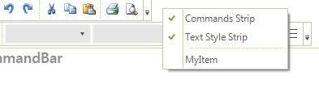

# Customize the control context menu

When the __RadCommandBar__ control is right clicked, a context menu enlisting the strips in the control together with __Customize__ menu option (allowing to customize the strips) is being shown. This context menu is being populated by the time of its opening and in order to customize its items, you should do that from within the __DropDownOpening__ event of this context menu. Here is how to subscribe to this event and how add your custom item and how to remove the __Customize__ option:
      
<snippet id='commandbar-customize-the-control-context-menu-subscribetocontextmenuopening-cs'/>
<snippet id='commandbar-customize-the-control-context-menu-subscribetocontextmenuopening-vb'/>

<snippet id='commandbar-customize-the-control-context-menu-customizethecontextmenu-cs'/>
<snippet id='commandbar-customize-the-control-context-menu-customizethecontextmenu-vb'/>

 

>caption Figure 1: CustomizeContextMenu
>

