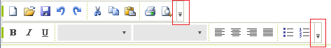
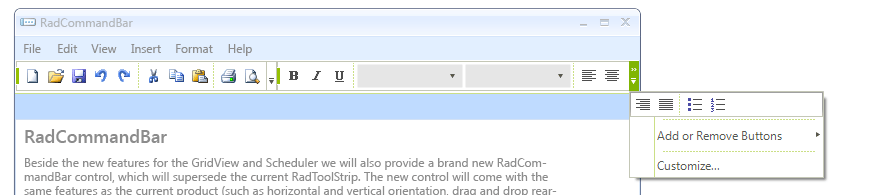
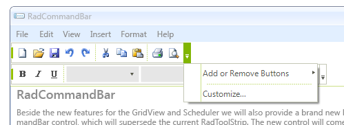
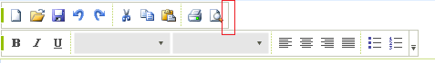

# Customize the overflow button

This article will demonstrate how to access the __Overflow__ button in __RadCommandBar__ and how to customize its items.
 

Each [CommandBarStripElement]() has its own __Overflow__ button. This button has a drop down, which contains of __"Add or Remove Buttons"__ menu item, __"Customize..."__ menu item and  __RadMenuSeparatorItems__ items. Additionally, if there is not enough space on the control to fit all the items, they will be displayed in the drop down menu as well.
 

The following example, demonstrates how to access the __RadMenuItems__ of the __Overflow__ button. For your convenience we have exposed the __CustomizeButtonMenuItem__ and the __AddRemoveButtonsMenuItem__. 

<snippet id='commandbar-customize-the-overflow-button-hidemenuitems-cs'/>
<snippet id='commandbar-customize-the-overflow-button-hidemenuitems-vb'/>

 

Alternatively, if you need to hide the whole __Overflow__ button, simply set its Visibility property to *Collapsed* 
 

<snippet id='commandbar-customize-the-overflow-button-hidetheoverflowbutton-cs'/>
<snippet id='commandbar-customize-the-overflow-button-hidetheoverflowbutton-vb'/>

 

