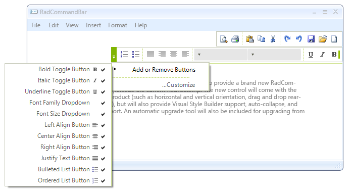

# Right-to-left support

## 

You can present the content of your commandbar instance in a right-to-left direction by setting the __RightToLeft__ property to *Yes*: 

<snippet id='commandbar-right-to-left-support-rtl-cs'/>
<snippet id='commandbar-right-to-left-support-rtl-vb'/>

 

