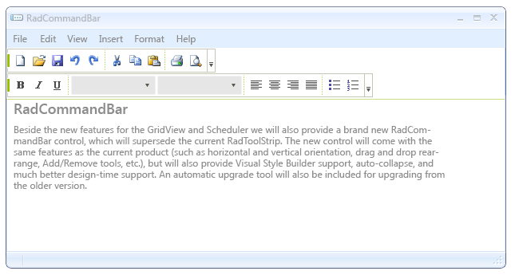
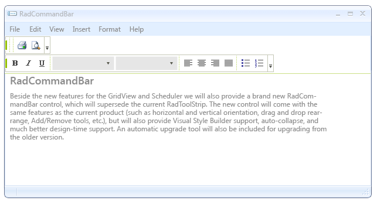

# Save and Load Layout

__RadCommandBar__ allows  the user to add and remove items and rearrange strip elements on different rows. The Save/Load layout functionality gives your applications the opportunity to preserve user settings concerning position, visibility and orientation.      

When you save the layout, all the preferences of a user will be saved in an XML file. When you load the file, the saved layout settings will be applied to __RadCommandBar__.

Here is an example demonstrating how you can implement a *Save Layout* button event handler:

Initially the layout looks like this:

 
 
<snippet id='commandbar-save-and-load-layout-savelayout-cs'/>
<snippet id='commandbar-save-and-load-layout-savelayout-vb'/>

 
 

Now we are going to set some of the items __VisibleInStrip__ properties to *false*

The code snippets below demonstrate how you can implement a *Load Layout* button event handler:  
<snippet id='commandbar-save-and-load-layout-loadlayout-cs'/>
<snippet id='commandbar-save-and-load-layout-loadlayout-vb'/>

 

After loading the layout it will reload the initial settings of the existing items:

>important When loading the layout it will only load the settings for the items that were there by the time when the layout was saved. If some of the items (i.e. CommandBarButton, CommandBarToggleButton) were deleted - the layout loading will not recreate them and if some items were added the layout will not effect them either.
>

__Sample save/load scenario__

The following example demonstrates how you can save the layout settings of a __RadCommandBar__ when the parent form of this command bar is closed and how you can load these settings when the form is reopened. Basically, you need to handle the __Load__ and __FormClosing__ events of the form.  
 
<snippet id='commandbar-save-and-load-layout-autoloadlayoutonformload-cs'/>
<snippet id='commandbar-save-and-load-layout-autoloadlayoutonformload-vb'/>

 

