# Structure 

>caption Figure 1: RadCommandBar's elements hierarchy

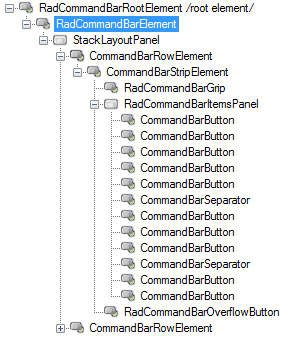

The Telerik __RadCommandBar__ is built up of five levels of nested components:
      

* RadCommandbar

	* RadCommandBarElement

		* CommandBarRowElement (Rows Collection)

			* CommandBarStripElement (Strips Collection)

				* RadCommandBarGripButton

				* Items ( arranged in ItemsLayout)

				* RadCommandBarOverflowButton

## RadCommandBar

The __RadCommandBarElement__ object represents the overall area of the form occupied by the Telerik __RadCommandBar__.

>caption Figure 2: RadCommandBarElement

## CommandBarRowElement

The __CommandBarRowElement__ object represents a horizontal or vertical line within the __RadCommandBarElement__ where individual strip elements are displayed.

>caption Fig.3 CommandBarRowElement

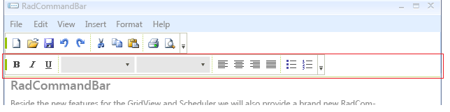

## CommandBarStripElement

The __CommandBarStripElement__ object represents an individual toolstrip within a __CommandBarRowElement__. Descendants of the __RadCommandBarBaseItem__ are arranged within a particular __CommandBarStripElement__.

>caption Fig.4 CommandBarStripElement

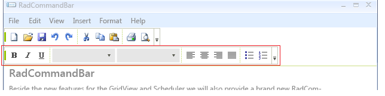

## RadCommandBarBaseItem descendants

You can add these item types to the __CommandBarStripElement__ from the context menu or the RadElement Collection Editor:

| Name | Example | Description |
| ------ | ------ | ------ |
|CommandBarButton|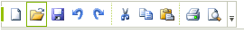|Displays a button containing text, an image, or both. Set the DrawText property to true to display the text of the button. Use the TextImageRelation property to control the layout of image and text: Overlay, ImageAboveText, TextAboveImage, ImageBeforeText, TextBeforeImage.|
|CommandBarToggleButton|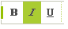|Displays a button that can toggle between "pressed" and "unpressed" states. The button element ToggleState property indicates the current condition of the button.|
|CommandBarTextBox|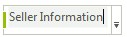|Displays a text box that can accept user input. Use the Text property to get and set its content.|
|CommandBarDropDownList|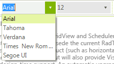|Displays a dropdown list. Use the SelectedIndexChanged and SelectedValueChanged events to respond to user choices.|
|CommandBarLabel|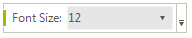|Displays static text on a strip element. Set the Text property to change the content.|
|CommandBarSeparatorItem|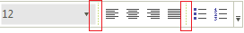|Adds empty space between other elements on a strip element.|
|CommandBarDropDownButton|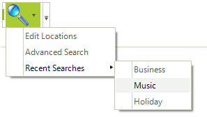|Displays a button with a drop-down arrow. Clicking the drop-down arrow displays a menu of choices. Use the Items property to populate the menu. Attach event handlers for individual element events in code to respond to user actions.|
|CommandBarSplitButton|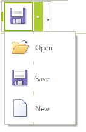|Displays a button with a drop-down arrow. Clicking the drop-down arrow displays a menu of choices. Clicking the button has the same effect as clicking the default item from the menu.|
|CommandBarHostItem|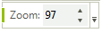|Item that can host any RadElement. Use the **HostedItem** property to get/set the element that you are hosting. Please check the example [WinForms RadCommandBar here]().|
|CommandBarMaskedEditBox|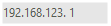|Displays [WinForms RadCommandBar RadMaskedEditBox]().|

>caption Fig.5 RadCommandBarBaseItem 

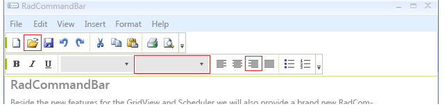
