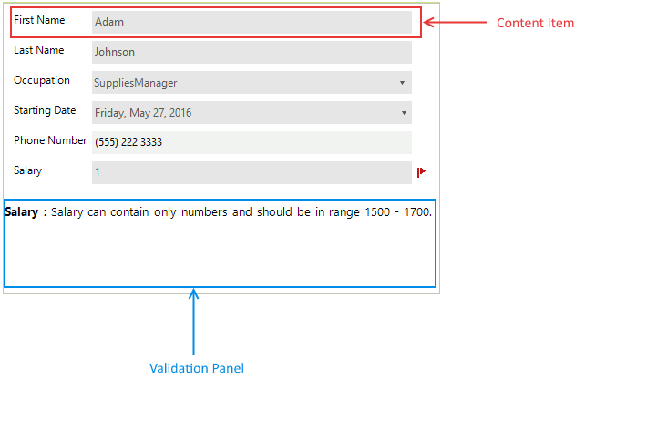
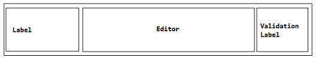

# Control Element Structure 

__RadDataEntry__ control inherits __RadScrollablePanel__ control, so __RadDataEntry__ has support for horizontal and vertical scrollbars. In __RadDataEntry__ there is embedded Validation Panel that can be used to show some additional information according the validation requirements. The figure below demonstrates the structure of __RadDataEntry__.

>caption Figure 1: RadDataEntry Structure

__RadDataEntry__ generates content item for each public property that can be edited. These items represent one __RadPanel__ with hidden border and inside this panel, there are two labels and one editor.

>caption Figure 2: RadDataEntry Item Layout        

The validation label does not have any text by default. It is designed to be used in cases where users want to show some additional information.
        
# See Also

 * [Getting Started]()
 * [Properties, events and attributes]()
 * [Themes]()
 * [Change the editor to RadDropDownList]()
