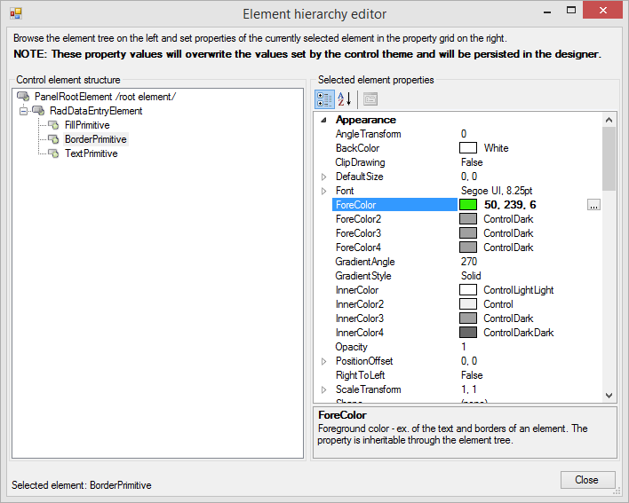
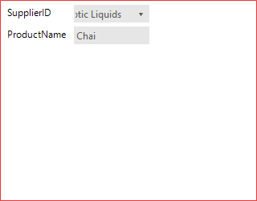
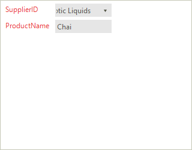
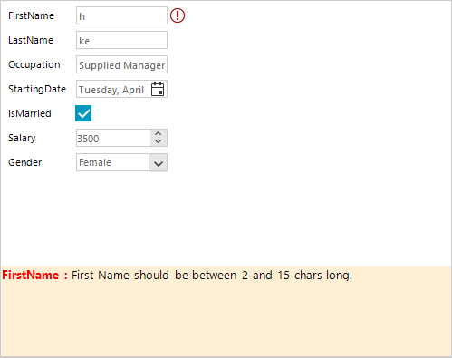

# Customizing Appearance

Accessing and customizing elements can be performed either at design time, or at run time. Before proceeding with this topic, it is recommended to get familiar with the [visual structure]() of the RadDataEntry.

## Design Time

You can access and modify the style for different elements in __RadDataEntry__ by using the `Element Hierarchy Editor`.

>caption Figure 1: Element Hierarchy Editor

   

## Programmatically

The following snippet show how you can customize the RadDataEntry styles at runtime. 

#### Change Border Color

<snippet id='dataentry-customizing-appearance-setbordercolor-cs'/>
<snippet id='dataentry-customizing-appearance-setbordercolor-vb'/>

>caption Figure 2: The changed border.

  

## Changing The Styles Of The Underlying Controls. 

The following snippet shows how you access the underlying controls and change the their styles:

#### Set Labels ForeColor

<snippet id='dataentry-customizing-appearance-labelcolor-cs'/>
<snippet id='dataentry-customizing-appearance-labelcolor-vb'/>

>caption Figure 3: Set Labels ForeColor.

  

## Changing Validation Panel BackColor

The following code snippets represent how to change the BackColor property of Validation Panel:

### Change Back Color

<snippet id='dataentry-customizing-appearance-changebackcolor-cs'/>
<snippet id='dataentry-customizing-appearance-changebackcolor-vb'/>

>caption Figure 4: Set Validaton Panel BackColor.

  

# See Also

 * [Structure]()
 * [Getting Started]()
 * [Properties, events and attributes]()
 * [Themes]()
 * [Change the editor to RadDropDownList]()
