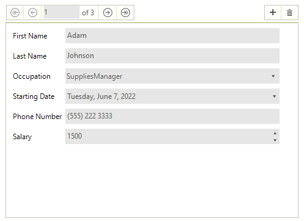

# WinForms DataEntry Overview

__RadDataEntry__ provides an easy way to display and edit arbitrary business objects in a form layout. The built-in editors are generated by default, so that a fully operational CRUD support may be achieved with a single line of code - just binding to the business object or to a collection of objects. In order to further enhance __RadDataEntry__, it can be used in combination with [RadBindingNavigator]() or any other collection navigation control.





__RadDataEntry__ control generates various editors depending on the type of property that should be editing:

* __RadTextBox__ for string properties.

* __RadCheckBox__ for Boolean.

* __RadDateTimePicker__ for dates.

* __RadDropDownList__ for enumerations. 

* __RadColorBox__ for Color.

* __PictureBox__ for Image.

> With the R2 2022 SP1 version of our control, a __RadSpinEditor__ control will be used as the default editor for all numeric types.

* __RadSpinEditor__ for numeric properties.

In addition __RadDataEntry__ allows manual setting and customization of editors and their layouts via the standard for windows forms practices. It is highly customizable, allowing the user to modify the default look in easy and intuitive manner.

>caption Figure 1: RadDataEntry

## Telerik UI for WinForms Learning Resources
* [Telerik UI for WinForms DataEntry Homepage](https://www.telerik.com/products/winforms/dataentry.aspx)
* [Get Started with the Telerik UI for WinForms DataEntry]()
* [Telerik UI for WinForms API Reference](https://docs.telerik.com/devtools/winforms/api/)
* [Getting Started with Telerik UI for WinForms Components]()
* [Telerik UI for WinForms Virtual Classroom (Training Courses for Registered Users)](https://learn.telerik.com/learn/course/external/view/elearning/17/TelerikUIforWinForms) 
* [Telerik UI for WinForms Forum](https://www.telerik.com/forums/winforms)
* [Telerik UI for WinForms Knowledge Base](https://docs.telerik.com/devtools/winforms/knowledge-base)

## Telerik UI for WinForms Additional Resources
* [Telerik UI for WinForms Product Overview](https://www.telerik.com/products/winforms.aspx)
* [Telerik UI for WinForms Blog](https://www.telerik.com/blogs/desktop-winforms)
* [Telerik UI for WinForms Videos](https://www.telerik.com/videos/product/winforms)
* [Telerik UI for WinForms Roadmap](https://www.telerik.com/support/whats-new/winforms/roadmap)
* [Telerik UI for WinForms Pricing](https://www.telerik.com/purchase/individual/winforms.aspx)
* [Telerik UI for WinForms Code Library](https://www.telerik.com/support/code-library/winforms)
* [Telerik UI for WinForms Support](https://www.telerik.com/support/winforms)
* [What’s New in Telerik UI for WinForms](https://www.telerik.com/support/whats-new/winforms)

# See Also

 * [Structure]()
 * [Getting Started]()
 * [Properties, events and attributes]()
 * [Themes]()
 * [Change the editor to RadDropDownList]()
