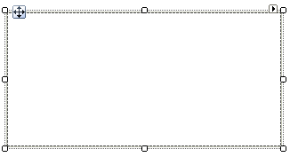
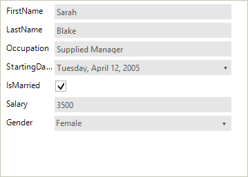
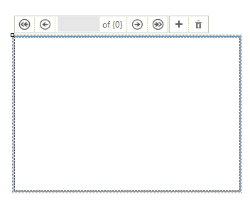
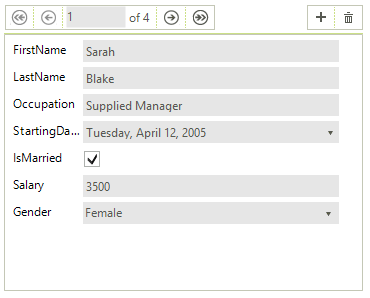

# Getting Started with WinForms DataEntry

This tutorial demonstrates how bind __RadDataEntry__ to business object and to a collection of objects.

## Adding Telerik Assemblies Using NuGet

To use `RadDataEntry` when working with NuGet packages, install the `Telerik.UI.for.WinForms.AllControls` package. The [package target framework version may vary]().

Read more about NuGet installation in the [Install using NuGet Packages]() article.

>tip With the 2025 Q1 release, the Telerik UI for WinForms has a new licensing mechanism. You can learn more about it [here]().

## Adding Assembly References Manually

When dragging and dropping a control from the Visual Studio (VS) Toolbox onto the Form Designer, VS automatically adds the necessary assemblies. However, if you're adding the control programmatically, you'll need to manually reference the following assemblies:

* __Telerik.Licensing.Runtime__
* __Telerik.WinControls__
* __Telerik.WinControls.UI__
* __TelerikCommon__

The Telerik UI for WinForms assemblies can be install by using one of the available [installation approaches](). 

## Defining the RadDataEntry

### Binding RadDataEntry to a single object

1\. Place a __RadDataEntry__ control on a form. 

2\. For the purpose of this tutorial, we will create a new class Employee with a couple of exposed properties
            

<snippet id='dataentry-getting-started-empl1-cs'/>
<snippet id='dataentry-getting-started-empl1-vb'/>

 

3\. Once the class Employee is defined, you may use it for creating an object of this type and bind it to the <b>RadDataEntry</b> control: 
	
<snippet id='dataentry-getting-started-bind1-cs'/>
<snippet id='dataentry-getting-started-bind1-vb'/>

 

4\. Press <b>F5</b> to run the project and you should see the following:
 

>note  In case you want to be notified for changes made on the data item, the class Employee should implement [INotifyPropertyChanged ]( http://msdn.microsoft.com/en-us/library/system.componentmodel.inotifypropertychanged%28v=vs.110%29.aspx ) Interface and raise the  __PropertyChanged__  event every time a property value changes.
 
###  Binding RadDataEntry to collection from objects
      

The following tutorial will demonstrate how to bind __RadDataEntry__ to a collection of objects and navigate through it. In order to navigate through the collection we will use  [RadBindingNavigator](). __RadBindingNavigator__ is designed to use as data source a [ BindingSource ]( http://msdn.microsoft.com/en-us/library/system.windows.forms.bindingsource%28v=vs.110%29.aspx ) component. 
        

1\. Place __RadDataEntry__, __RadBindingNavigator__  and a BindingSource component on a form. Dock the navigator to *Top* and the data entry to *Fill*.
 

2\. Create List of business objects and set it as data source of BindingSource.
             
<snippet id='dataentry-getting-started-bind2-cs'/>
<snippet id='dataentry-getting-started-bind2-vb'/>

 
 
3\. Set this __BindingSource__ to __RadBindingNavigator__ and __RadDataEntry__.
            

<snippet id='dataentry-getting-started-bind3-cs'/>
<snippet id='dataentry-getting-started-bind3-vb'/>

 

4\. Press __F5__ to run the project and you should see the following:
 

>note **RadDataEntry** allows you to set the **DataSource** property at design time as well, e.g. to a **BindingSource** that is available. Thus, the respective editors will be generated inside **RadDataEntry**.

## See Also

 * [Structure]()
 * [Properties, events and attributes]()
 * [Validation]()
 * [Themes]()
 * [Change the editor to RadDropDownList]()

## Telerik UI for WinForms Learning Resources
* [Telerik UI for WinForms Dataentry Component](https://www.telerik.com/products/winforms/dataentry.aspx)
* [Getting Started with Telerik UI for WinForms Components](https://docs.telerik.com/devtools/winforms/getting-started/first-steps)
* [Telerik UI for WinForms Setup](https://docs.telerik.com/devtools/winforms/installation-and-upgrades/installing-on-your-computer)
* [Telerik UI for WinForms Application Modernization](https://docs.telerik.com/devtools/winforms/winforms-converter/overview)
* [Telerik UI for WinForms Visual Studio Templates](https://docs.telerik.com/devtools/winforms/visual-studio-integration/visual-studio-templates)
* [Deploy Telerik UI for WinForms Applications](https://docs.telerik.com/devtools/winforms/deployment-and-distribution/application-deployment)
* [Telerik UI for WinForms Virtual Classroom(Training Courses for Registered Users)](https://learn.telerik.com/learn/course/external/view/elearning/17/telerik-ui-for-winforms)
* [Telerik UI for WinForms License Agreement)](https://www.telerik.com/purchase/license-agreement/winforms-dlw-s)

