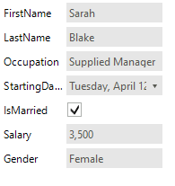

# Change auto generated editor

By default __RadDataEntry__ generates several different editors according to the data type of the property that it should edit. The following table demonstrates the default editors that __RadDataEntry__ can create.
 
|enum|RadDropDownList|
|----|----|
|DateTime|RadDateTimePicker|
|Boolean|RadCheckBox|
|Color|RadColorBox|
|Image|PictureBox|
|string|RadTextBox|
|Byte, SByte, UInt16, UInt32, UInt64, Int16, Int32, Int64, Single, Double, Decimal|RadSpinEditor|

>note For any type that is not represented in this table  __RadDataEntry__  generates  __RadTextBox__ .

In the following example it will be demonstrated how to change default editor with the custom one.

1\. For the purpose of this tutorial, we will create a new class Employee with a couple of exposed properties. By binding __RadDataEntry__ to object from this type we will generate several items.

#### Data Object            

<snippet id='dataentry-getting-started-empl1-cs'/>
<snippet id='dataentry-getting-started-empl1-vb'/>

#### Data Binding

<snippet id='dataentry-getting-started-bind1-cs'/>
<snippet id='dataentry-getting-started-bind1-vb'/>

>caption Figure 1: RadDataEntry Initializing.

2\. To change the default __RadTextBox__ editor of the “Salary” property with __RadMaskedEditBox__ we will subscribe to *EditorInitializing* event of __RadDataEntry__.
           
<snippet id='dataentry-change-auto-generated-editor-editorinitializing-cs'/>
<snippet id='dataentry-change-auto-generated-editor-editorinitializing-vb'/>

3\. To achieve working binding for this new editor we should subscribe to the *BindingCreated* event where we will subscribe to the *Parse* event of the Binding object. You can read more about *Format* and *Parse* events of Binding object and why we should use them [here](http://msdn.microsoft.com/en-us/library/system.windows.forms.binding_events%28v=vs.110%29.aspx).

#### Subscribe to Parse Event

<snippet id='dataentry-change-auto-generated-editor-bindingcreated-cs'/>
<snippet id='dataentry-change-auto-generated-editor-bindingcreated-vb'/>

>caption Figure 2: RadDataEntry MaskedEditBox.

 

## RadSpinEditor Default Values

The spin editor is created with the default settings for __Minimum/Maximum, DecimalPlaces, and Step__. If a case, you are using fractional numbers, the decimal part will be lost so we need to change the above properties. You can do that in the __EditorInitializing__.

<snippet id='dataentry-change-auto-generated-editor-spineditordefaultvalues-cs'/>
<snippet id='dataentry-change-auto-generated-editor-spineditordefaultvalues-vb'/>

# See Also

 * [Structure]()
 * [Getting Started]()
 * [Properties, events and attributes]()
 * [Themes]()
 * [Change the editor to RadDropDownList]()
 * [How to Use RadSpinEditor for Nullable Numeric Fields in RadDataEntry]()
