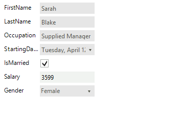

# Programmatically Arrange Items

Items in __RadDataEntry__ can be arranged both at design time and run time. At design time users can use the designer to arrange the items according to their needs by drag and drop or by setting the desired properties of the items. However at run time there is no designer that can be used to arrange them, so to achieve the desired layout the user should use the exposed events or to access the controls from the __Controls__ collection and to change their location, size and etc. The following example will demonstrate how to use the control events to arrange the generated items.

1\. For the purpose of this tutorial, we will create a new class Employee with a couple of exposed properties. By binding __RadDataEntry__ to object from this type we will generate several items.

#### Data Object

<snippet id='dataentry-getting-started-empl1-cs'/>
<snippet id='dataentry-getting-started-empl1-vb'/>

#### Data Binding 

<snippet id='dataentry-getting-started-bind1-cs'/>
<snippet id='dataentry-getting-started-bind1-vb'/>

>caption Figure 1: RadDataEntry is initialized.

2\. To arrange the items we will subscribe to the *ItemInitialized* event of __RadDataEntry__. This event is triggered when an item is initialized, so it is suitable to introduce changes.

#### Special Arrangement

<snippet id='dataentry-programmatically-arrange-items-iteminitialized-cs'/>
<snippet id='dataentry-programmatically-arrange-items-iteminitialized-vb'/>

>caption Figure 2: The whole name is now displayed in the first row. 

# See Also

 * [Structure]()
 * [Getting Started]()
 * [Properties, events and attributes]()
 * [Validation]()
 * [Themes]()
 * [Change the editor to RadDropDownList]()
