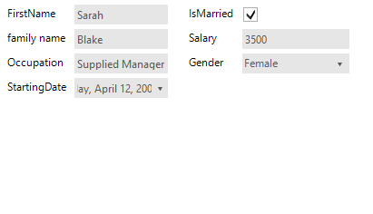
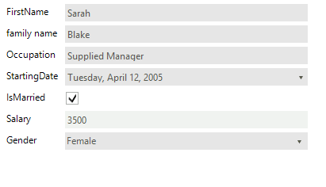
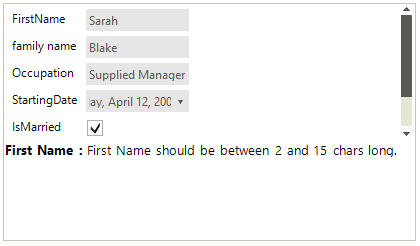
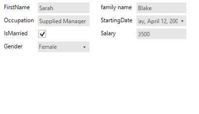
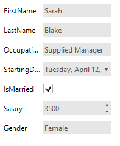
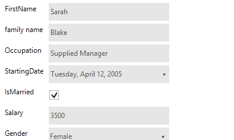
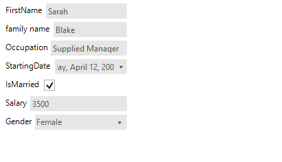
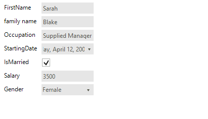

# Properties, Events and Attributes

## Properties

The main purpose of __RadDataEntry__ is to generate editors according to the object properties and to create simple data bindings for them. For this reason, most of the control properties will take effect only if they are set __before setting the DataSource.__

* The most important property of __RadDataEntry__ is __DataSource__. Through this property user can set the business object or a collection of objects that should be editing. When this property is set __RadDataEntry__ generates editors for each public property which does not have its __Browsable__ attribute set to *false.* 

#### RadDataEntry Binding.

<snippet id='dataentry-getting-started-bind1-cs'/>
<snippet id='dataentry-getting-started-bind1-vb'/>

 

>caption> Figure 1: Set The Data Source of RadDataEntry

* The __ColumnCount__ property controls the amount of columns that __RadDataEntry__ will use to arrange generated controls. Default value is 1 
 
#### Set the Columns Count.

<snippet id='dataentry-properties-events-and-attributes-numberofcolumns-cs'/>
<snippet id='dataentry-properties-events-and-attributes-numberofcolumns-vb'/>

 

>caption Figure 2: Set The Columns Count.

* The __FitToParentWidth__ property controls whether the generated editors should fit their width to width of the __RadDataEntry__. Default Value is *false*. 

#### Set FitToParentWidth Property.

<snippet id='dataentry-properties-events-and-attributes-fittoparentwidth-cs'/>
<snippet id='dataentry-properties-events-and-attributes-fittoparentwidth-vb'/>

 

>caption Figure 3. Set FitToParentWidth

* The __ShowValidationPanel__ property controls the visibility of validation panel. Please note that this property will change the visibility of panel if only there are controls inside it. By default this panel is disabled.
            
#### Setup the Validation Panel.

<snippet id='dataentry-properties-events-and-attributes-showvalidationpanel-cs'/>
<snippet id='dataentry-properties-events-and-attributes-showvalidationpanel-vb'/>

 

>caption Figure 4: The Validation Panel.

* The __FlowDirection__ controls the direction the editors will be generated when the __ColumnCount__ property has value bigger than 1. 

### Set the Flow Direction.

<snippet id='dataentry-properties-events-and-attributes-fillingorder1-cs'/>
<snippet id='dataentry-properties-events-and-attributes-fillingorder1-vb'/>

 

>caption Figure 5: Set the flow direction.

* The __ItemSpace__ property controls the space that between the generated items. Default value is 5 pixels.
           
#### Set Space Between The Items.

<snippet id='dataentry-properties-events-and-attributes-itemspace-cs'/>
<snippet id='dataentry-properties-events-and-attributes-itemspace-vb'/>

 

>caption Figure 6 Set the items space.

* The __ItemDefaultSize__ property sets the size that generated items should have if __FitToParentWidth__ property has value *false*. When property the __FitToParentWidth__ has value *true* the width of items are calculated according the width of the __RadDataEntry__ control and the number of the columns. In this case the width defined with __ItemDefaultSize__ is ignored. 

#### Set items default size.

<snippet id='dataentry-properties-events-and-attributes-itemdefaultsize-cs'/>
<snippet id='dataentry-properties-events-and-attributes-itemdefaultsize-vb'/>

 

>caption Figure 7. Set items size.

* In __RadDataEntry__ control there is logic that arranges the labels of the editors in one column according to the longest text. This logic can be controlled by the __AutoSizeLabels__ property. By default the property value is __false__ and the labels width will equals the longest label width. If you set this property to __true__, the labels will be sized according to their content, as shown on the following figure: 

#### Set The AutoSizeLabels Property.

<snippet id='dataentry-properties-events-and-attributes-resizelabels-cs'/>
<snippet id='dataentry-properties-events-and-attributes-resizelabels-vb'/>

 

>caption Figure 8: The Labels are not Auto-Sized.

## Events

There are several events that you will find useful in the context of __RadDataEntry__:
        

__EditorInitializing__ - Occurs when editor is being initialized. This event is cancelable. In this event you can change the default editors with custom ones.

__EditorInitialized__  - Occurs when the editor is Initialized.

__BindingCreating__ - Occurs when a binding object for an editor is about to be created. This event is cancelable.

__BindingCreated__ - Occurs when binding object is created.

__ItemInitializing__ – this event is firing when the panel that contains the label, editor and validation label is about to be Initialized. This event is cancelable.

__ItemInitialized__ - occurs the item is already Initialized.

__ItemValidating__ – this event is fired when any of the generated editors fires its Validating event.

__ItemValidated__ – this event is fired when any of the generated editors fires its Validated event.

## Attributes

__RadDataEntry__ has support for several attributes that can be used to change the behavior of the control.

With the __Browsable__ attribute users can easily control which properties should be displayed 

>note The **Browsable** attribute set to *false* will make the property on which it is used not bindable. This will prevent other controls which use the [CurrencyManager](https://msdn.microsoft.com/en-us/library/system.windows.forms.currencymanager(v=vs.110).aspx) for extracting properties to bind to such a class. A suitable solution for this scenario is to leave the property **Browsable** set to *true* and handle the **RadDataEntry**.*ItemInitializing* setting the e.Cancel property to *true* for items which need to hidden in **RadDataEntry**.  

#### Set The Browsable Attribute. 

<snippet id='dataentry-properties-events-and-attributes-browsable-cs'/>
<snippet id='dataentry-properties-events-and-attributes-browsable-vb'/>

 

The __DisplayName__ attribute defines what text should be displayed in the label that is associated with the editor. 

#### Set The DisplayName Attribute.

<snippet id='dataentry-properties-events-and-attributes-displayname-cs'/>
<snippet id='dataentry-properties-events-and-attributes-displayname-vb'/>

 

With __RadRange__ attribute users can define range that can be used into validation process. This attribute is provided in validation events. 

#### Set The RadRange Attribute

<snippet id='dataentry-properties-events-and-attributes-radrange-cs'/>
<snippet id='dataentry-properties-events-and-attributes-radrange-vb'/>

 

# See Also

 * [Structure]()
 * [Getting Started]()
 * [Validation]()
 * [Themes]()
 * [Change the editor to RadDropDownList]()
