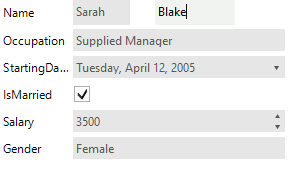
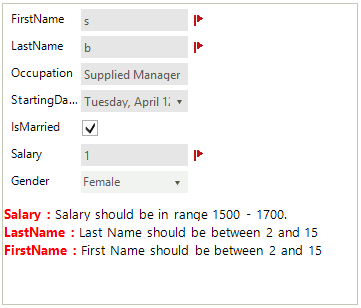

# Validation

For the need of validation process we made two events (__ItemValidating, ItemValidated__) that are firing when the __Validating__ and __Validated__ events occur in the editors. __RadDataEntry__ provides three different ways to show to the users that some editors do not match to validation criteria – Validation label, Error provider and Validation Panel. In the following tutorial we will demonstrate how use validation panel together with Error provider.

1\. For the purpose of this tutorial, we will create a new class Employee with a couple of exposed properties. By binding __RadDataEntry__ to object from this type we will generate several items: 

#### DataObject

<snippet id='dataentry-getting-started-empl1-cs'/>
<snippet id='dataentry-getting-started-empl1-vb'/>

 

#### Data Binding

<snippet id='dataentry-getting-started-bind1-cs'/>
<snippet id='dataentry-getting-started-bind1-vb'/>

>caption Figure 1: RadDataEntry is initialized.

2\. Set the __ShowValidationPanel__ property to true. This will display the panel below the editors:
            

<snippet id='dataentry-validation-showvalidationpanel2-cs'/>
<snippet id='dataentry-validation-showvalidationpanel2-vb'/>

 

3\. Subscribe to the __ItemValidated__ event of __RadDataEntry__:

#### Data Validation

<snippet id='dataentry-validation-itemvalidated-cs'/>
<snippet id='dataentry-validation-itemvalidated-vb'/>

>caption Figure 2. The Validation panels shows the error message.

In this tutorial we also used and Error provider to show error icon next to the editors. You can read more about Microsoft Error provider here - [ErrorProvider Class](http://msdn.microsoft.com/en-us/library/system.windows.forms.errorprovider%28v=vs.110%29.aspx)

# See Also

 * [Structure]()
 * [Getting Started]()
 * [Properties, events and attributes]()
 * [Themes]()
 * [Change the editor to RadDropDownList]()
