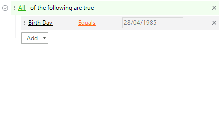

# Custom Display Names

The names behind each of the descriptor items are extracted from the data-bound object. **RadDataFilter** exposes the **PropertyDisplayNameNeeded** event providing means for customizing the displayed name of a field.

>caption Figure 1: Custom Display Names



#### PropertyDisplayNameNeeded Event

{{source=..\SamplesCS\DataFilter\DataFilterWorkingWithNodes.cs region=CustomDisplayNames}} 
{{source=..\SamplesVB\DataFilter\DataFilterWorkingWithNodes.vb region=CustomDisplayNames}}
````C#
private void RadDataFilter1_PropertyDisplayNameNeeded(object sender, PropertyDisplayNameNeededEventArgs e)
{
    if (e.FieldName == "BirthDay")
    {
        e.DisplayName = "Birth Day";
    }
}

````
````VB.NET
Private Sub RadDataFilter1_PropertyDisplayNameNeeded(sender As Object, e As PropertyDisplayNameNeededEventArgs)
    If e.FieldName = "Birth Day" Then
        e.DisplayName = "Birth Day"
    End If
End Sub

````


{{endregion}}

# See Also

* [Getting Started ]()
* [Unbound Mode]()	
* [Data Binding]()	
