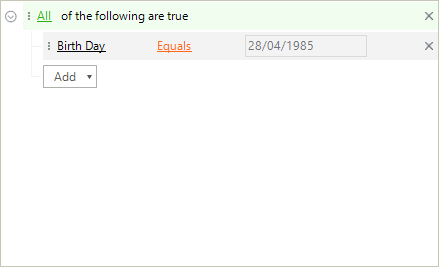

# Custom Display Names

The names behind each of the descriptor items are extracted from the data-bound object. **RadDataFilter** exposes the **PropertyDisplayNameNeeded** event providing means for customizing the displayed name of a field.

>caption Figure 1: Custom Display Names

#### PropertyDisplayNameNeeded Event

<snippet id='datafilter-custom-display-names-customdisplaynames-cs' />
<snippet id='datafilter-custom-display-names-customdisplaynames-vb' />

# See Also

* [Getting Started ]()
* [Unbound Mode]()	
* [Data Binding]()	
