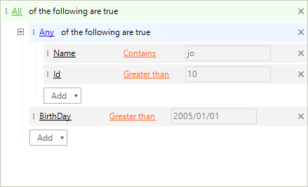
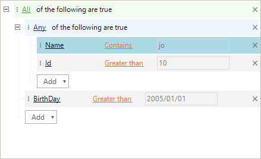
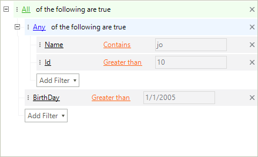
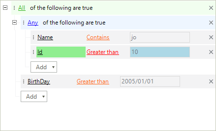

# Formatting Nodes

__RadDataFilter__ is a virtualized control reusing its visual elements. It exposes a __NodeFormatting__ event with which its nodes can be easily accessed and customized. The arguments of this event also return the associated data node providing information about the applied descriptor.

>note The UI of __RadDataFilter__ is virtualized and its visual elements are reused. An '*else*' clause is needed for each '*if*' statement in the implementation of the __NodeFormatting__ event. Skipping this operation will lead to an incorrect styling.
>

## Formatting Group Nodes

Group nodes can be formatted to handle custom scenarios. The root node in the example below has its expander item hidden.

>caption Figure 1: Hidden Expander Item

#### Group Nodes

<snippet id='datafilter-formatting-nodes-groupnodes-cs' />
<snippet id='datafilter-formatting-nodes-groupnodes-vb' />

## Formatting Expression Nodes

The appearance of the expression nodes can also be modified to change their visual appearance. 

>caption Figure 2: Changed Back Color

#### Expression Nodes

<snippet id='datafilter-formatting-nodes-expressionnodes-cs' />
<snippet id='datafilter-formatting-nodes-expressionnodes-vb' />

## Formatting Button Nodes

The button responsible for adding a new expression can also be customized in a formatting event.  

>caption Figure 3: Add Button Text

#### Button Nodes

<snippet id='datafilter-formatting-nodes-addbutton-cs' />
<snippet id='datafilter-formatting-nodes-addbutton-vb' />

## Formatting Child Expression Elements

Each of the nodes holding the expressions has three editor elements which can be accessed in the __NodeFormatting__ and have their styles modified.

>caption Figure 3: Add Button Text

#### Child Expression Elements

<snippet id='datafilter-formatting-nodes-childexpressionelements-cs' />
<snippet id='datafilter-formatting-nodes-childexpressionelements-vb' />

# See Also

* [Getting Started ]()
* [Unbound Mode]()	
* [Data Binding]()	
