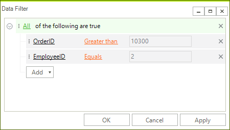

# DataFilter Dialog

**RadDataFilterDialog** can be used as a standalone dialog in order to provide the user an easy way to build an expression without the necessity to have a **RadDataFilter** on the form. 



You can find below a sample code snippet how to show the filter dialog and get its expression after the dialog is closed:

#### Showing the RadDataFilterDialog

{{source=..\SamplesCS\DataFilter\DataFilterGettingStarted.cs region=FilterDialog}} 
{{source=..\SamplesVB\DataFilter\DataFilterGettingStarted.vb region=FilterDialog}}

````C#
RadDataFilterDialog dialog = new RadDataFilterDialog();
dialog.DataSource = this.ordersBindingSource;
dialog.DataFilter.Expression = "[OrderID] > 10300 AND [EmployeeID] = 2";
dialog.ShowDialog();
string expression = dialog.DataFilter.Expression;

````
````VB.NET
Dim dialog As New RadDataFilterDialog()
dialog.DataSource = Me.ordersBindingSource
dialog.DataFilter.Expression = "[OrderID] > 10300 AND [EmployeeID] = 2"
dialog.ShowDialog()
Dim expression As String = dialog.DataFilter.Expression

```` 

{{endregion}}

If you need to customize the performed action on one of the buttons in the filter dialog you can create a derivative of the **RadDataFilterDialog** and override the **OnOKButtonClick**, **OnCancelButtonClick** or **OnApplyButtonClick** methods.

# See Also

* [Properties, Methods and Events]()	
* [Getting Started]()	
 