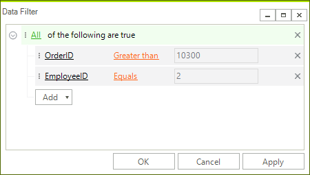

# DataFilter Dialog

**RadDataFilterDialog** can be used as a standalone dialog in order to provide the user an easy way to build an expression without the necessity to have a **RadDataFilter** on the form. 

You can find below a sample code snippet how to show the filter dialog and get its expression after the dialog is closed:

#### Showing the RadDataFilterDialog

<snippet id='datafilter-datafilter-dialog-filterdialog-cs' />
<snippet id='datafilter-datafilter-dialog-filterdialog-vb' />

If you need to customize the performed action on one of the buttons in the filter dialog you can create a derivative of the **RadDataFilterDialog** and override the **OnOKButtonClick**, **OnCancelButtonClick** or **OnApplyButtonClick** methods.

# See Also

* [Properties, Methods and Events]()	
* [Getting Started]()	
 
