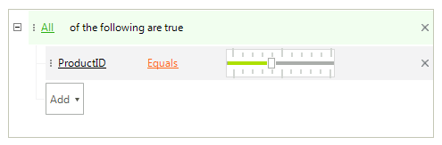

# Custom Editors

This article demonstrates a sample approach how to create and replace the standard spin editor with a track bar editor when editing numeric fields.

All editors inherit from **BaseInputEditor**. So, you have to inherit from this class and override several methods. The default spin editor for the *ProductID* field is replaced with the custom one in the **EditorRequired** event. In the **EditorInitialized** event we limit the maximum of the track bar and show the ticks.

>caption Figure 1: Replace the default editor with a custom editor

#### Custom editor

<snippet id='datafilter-custom-editors-customeditor-cs' />
<snippet id='datafilter-custom-editors-customeditor-vb' />

# See Also

* [Events]()	
* [Default Editors]()	
