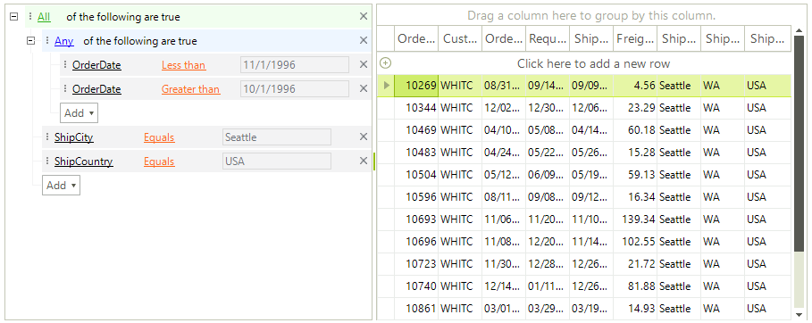

# RadDataFilter

Building complex filter expressions is a breeze with __RadDataFilter__. The control allows specifying expressions based on the fields.properties available in the data source. The intuitive UI of the control is designed to facilitate the end-user while empowering the developer to create related expressions with a few clicks.





### Key features:

* __Intuitive Expression Building:__  With the extremely intuitive UI, **RadDataFilter** is very user-friendly. Select your filter options with a simple point-and-click. The control allows specifying expressions based on the  fields available in the data source. You can build complex expressions on multiple fields with *And*/*Or* operators and myriad of filter functions.

* __Seamless Integration:__ **RadDataFilter** can communicate with __BidingSource__ (or any other class that implements **IBindingListView**), __DataTable__ and __DataView__. This allows you to pair the control with controls that display collections of items like GridView, TreeView, ComboBox, etc. 

# See Also

* [Getting Started]()
* [Design Time]()
