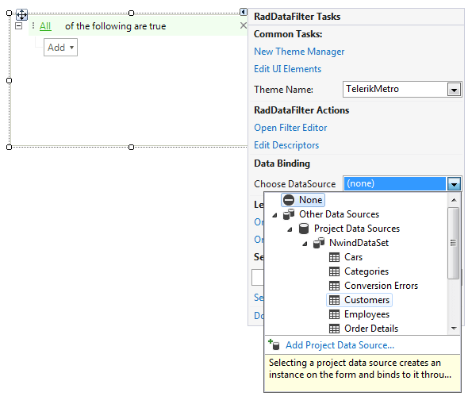
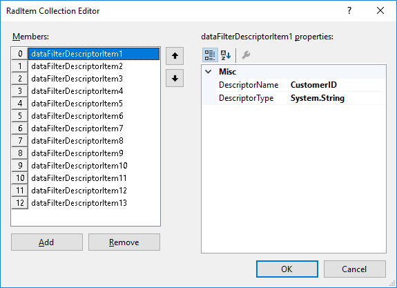
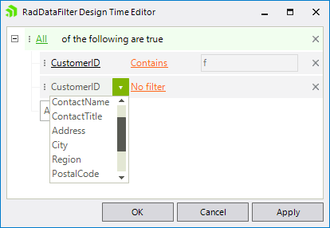
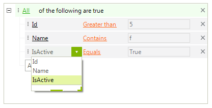

# Data Binding

**RadDataFilter** will read the properties of its **DataSource** and will automatically create the corresponding descriptor items for each of them. It accepts **DataTable**, **DataSet** and **BindingSource**.

## Design Time

You can set the **DataSource** property either via the **Smart Tag** or by the *Properties* section in Visual Studio.

>caption Figure 1: DataSource property in Smart Tag



After specifying the **DataSource** property, the **Descriptors** collection will be automatically populated with descriptor items considering the available fields in the source object.

>caption Figure 2: Automatically populated Descriptors collection



Then, if you open the *RadDataFilter Design Time Editor*, you can select the desired items in order to build a filter expression.

>caption Figure 3: RadDataFilter Design Time Editor



## Run Time

It is possible to set the **DataSource** property programmatically as well.

#### Setting DataSource at run time

{{source=..\SamplesCS\DataFilter\DataFilterGettingStarted.cs region=BoundMode}} 
{{source=..\SamplesVB\DataFilter\DataFilterGettingStarted.vb region=BoundMode}}

````C#
DataTable dt = new DataTable();
dt.Columns.Add("Id", typeof(int));
dt.Columns.Add("Name", typeof(string));
dt.Columns.Add("IsActive", typeof(bool));
this.radDataFilter1.DataSource = dt;

````
````VB.NET
Dim dt As New DataTable()
dt.Columns.Add("Id", GetType(Integer))
dt.Columns.Add("Name", GetType(String))
dt.Columns.Add("IsActive", GetType(Boolean))
Me.RadDataFilter1.DataSource = dt

```` 

{{endregion}}

After setting the **DataSource** property, the **Descriptors** collection is filled with the respective fields. Then, you can apply the desired filter either by setting the **Expression** property or by using the UI at run time.

>caption Figure 4: RadDataFilter bound at run time



# See Also

* [Unbound Mode]()	
* [Getting Started ]()