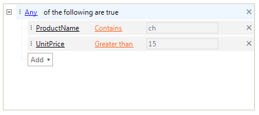

# Unbound Mode

This article demonstrates how to populate **RadDataFilter** with descriptor items and add the desired filter conditions to build an expression.

# Design Time
 
You can add/remove/modify **DataFilterDescriptorItems** by using the *RadItem Collection Editor* which can be shown either via the **Smart Tag** or by using the **Descriptors** property in the *Properties* section in Visual Studio. Then, you can add a *Group* or an *Expression* for composing the desired filters via the *RadDataFilter Design Time Editor*. Additional information is available in the [Design Time]() help article.

# Run Time

**RadDataFilter** supports adding descriptor items at run time. The following example demonstrates how to add two different descriptor items to the RadDataFilter.**Desciriptors** collection and apply an expression. 

#### Adding descriptor items programmatically and applying an expression

{{source=..\SamplesCS\DataFilter\DataFilterGettingStarted.cs region=UnboundMode}} 
{{source=..\SamplesVB\DataFilter\DataFilterGettingStarted.vb region=UnboundMode}}
````C#
DataFilterDescriptorItem nameDescriptorItem = new DataFilterDescriptorItem();
nameDescriptorItem.DescriptorName = "ProductName";
nameDescriptorItem.DescriptorType = typeof(string);
this.radDataFilter1.Descriptors.Add(nameDescriptorItem);
DataFilterDescriptorItem priceDescriptorItem = new DataFilterDescriptorItem();
priceDescriptorItem.DescriptorName = "UnitPrice";
priceDescriptorItem.DescriptorType = typeof(decimal);
this.radDataFilter1.Descriptors.Add(priceDescriptorItem);
this.radDataFilter1.Expression = "([ProductName] LIKE '%ch%' OR [UnitPrice] > '15')";

````
````VB.NET
Dim nameDescriptorItem As New DataFilterDescriptorItem()
nameDescriptorItem.DescriptorName = "ProductName"
nameDescriptorItem.DescriptorType = GetType(String)
Me.RadDataFilter1.Descriptors.Add(nameDescriptorItem)
Dim priceDescriptorItem As New DataFilterDescriptorItem()
priceDescriptorItem.DescriptorName = "UnitPrice"
priceDescriptorItem.DescriptorType = GetType(Decimal)
Me.RadDataFilter1.Descriptors.Add(priceDescriptorItem)
Me.RadDataFilter1.Expression = "([ProductName] LIKE '%ch%' OR [UnitPrice] > '15')"

```` 

{{endregion}}




# See Also

* [Data Binding]()	
