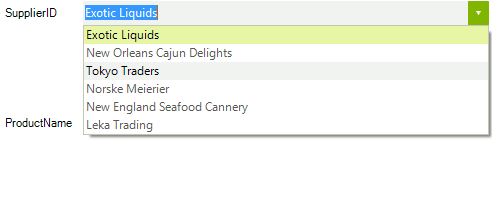

# Change the Editor to a Bound RadDropDownList

This article will walk you through the process of changing the default editor to a bound drop down list, where the current value corresponds to a value within the drop down list data source. The case where the corresponding values are nullable is also handled.
      
>caption Figure 1: DropDownListEditor

1\. First you can subscribe to the __BindingCreating__, __BindingCreated__ and __EditorInitializing__ events of __RadDataLayout__ (please note that this should be done before the control has been bound).

<snippet id='datalayout-change-the-editor-to-a-bound-raddropdownlist-subscribe-cs' />
<snippet id='datalayout-change-the-editor-to-a-bound-raddropdownlist-subscribe-vb' />

2\. In the __EditorInitializing__ event handler, you will be able to change the automatically generated editor with a __RadDropDownList__. In addition, you should set it up as needed. In this case we will set the __DataSource__, __DisplayMember__ and  __ValueMember__ properties.

<snippet id='datalayout-change-the-editor-to-a-bound-raddropdownlist-editor-cs' />
<snippet id='datalayout-change-the-editor-to-a-bound-raddropdownlist-editor-vb' />

3\. In order the values to be synchronized correctly, the bound property should be set in the __BindingCreating__ event handler. In this case it should be set to the __SelectedValue__ property.

<snippet id='datalayout-change-the-editor-to-a-bound-raddropdownlist-creating-cs' />
<snippet id='datalayout-change-the-editor-to-a-bound-raddropdownlist-creating-vb' />

4\. When the data source is using nullable values in order the user to be able to change the current value via the drop down list, the result value should be manually parsed. This can be done in the binding's __Parse__ event. You can subscribe to this event in the __BindingCreated__ event handler (in order this event to fire the formatting should be enabled).

<snippet id='datalayout-change-the-editor-to-a-bound-raddropdownlist-created-cs' />
<snippet id='datalayout-change-the-editor-to-a-bound-raddropdownlist-created-vb' />

To make the example complete you can use the following classes.

<snippet id='datalayout-change-the-editor-to-a-bound-raddropdownlist-data-cs' />
<snippet id='datalayout-change-the-editor-to-a-bound-raddropdownlist-data-vb' />

You can initialize the data sources in the Form’s constructor.

<snippet id='datalayout-change-the-editor-to-a-bound-raddropdownlist-init-cs' />
<snippet id='datalayout-change-the-editor-to-a-bound-raddropdownlist-init-vb' />

# See Also

 * [Structure]()
 * [Getting Started]()
 * [Properties, events and attributes]()
 * [Validation]()
 * [Customizing Appearance ]()
