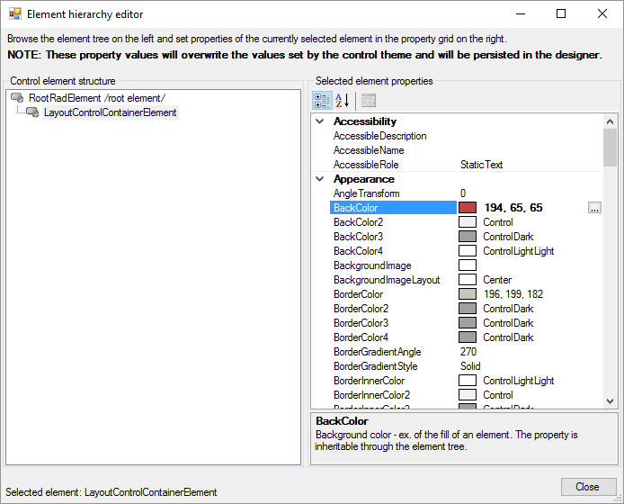
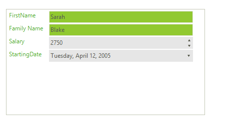

# Customizing Appearance

You can access and modify the style for different elements in __RadDataEntry__ by using the *Element Hierarchy Editor*.

>caption Figure 1: Element Hierarchy Editor

   

# Changing the styles of the underling items and controls

The following snippet shows how you access the underlying controls and change their style:


{{source=..\SamplesCS\DataLayout\PropertiesEventsAttributesForm.cs region=FormatItems}} 
{{source=..\SamplesVB\DataLayout\PropertiesEventsAttributesForm.vb region=FormatItems}}
````C#
foreach (DataLayoutControlItem item in radDataLayout1.LayoutControl.Items)
{
    item.ForeColor = ColorTranslator.FromHtml("#51ab2e");
    if (item.AssociatedControl is RadTextBox)
    {
        item.AssociatedControl.BackColor = ColorTranslator.FromHtml("#91c930");
    }
}

````
````VB.NET
For Each item As DataLayoutControlItem In RadDataLayout1.LayoutControl.Items
    item.ForeColor = ColorTranslator.FromHtml("#51ab2e")
    If TypeOf item.AssociatedControl Is RadTextBox Then
        item.AssociatedControl.BackColor = ColorTranslator.FromHtml("#91c930")
    End If
Next item

```` 

{{endregion}}

>caption Figure 2: Change the items styles

   

# See Also

 * [Structure]()
 * [Getting Started]()
 * [Properties, events and attributes]()
 * [Validation]()
 * [Change the editor to RadDropDownList]()
