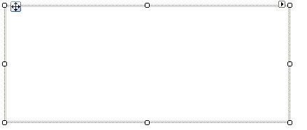
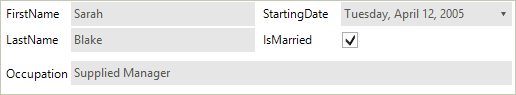
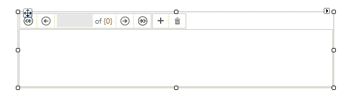
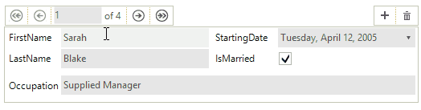

# Getting Started with WinForms DataLayout

This example demonstrates binding __RadDataLayout__ to a single object or a collection of objects. For the purpose of the tutorial we will also use a __RadBindingNavigator__.

## Adding Telerik Assemblies Using NuGet

To use `RadDataLayout` when working with NuGet packages, install the `Telerik.UI.for.WinForms.AllControls` package. The [package target framework version may vary]().

Read more about NuGet installation in the [Install using NuGet Packages]() article.

>tip With the 2025 Q1 release, the Telerik UI for WinForms has a new licensing mechanism. You can learn more about it [here]().

## Adding Assembly References Manually

When dragging and dropping a control from the Visual Studio (VS) Toolbox onto the Form Designer, VS automatically adds the necessary assemblies. However, if you're adding the control programmatically, you'll need to manually reference the following assemblies:

* __Telerik.Licensing.Runtime__
* __Telerik.WinControls__
* __Telerik.WinControls.UI__
* __TelerikCommon__

The Telerik UI for WinForms assemblies can be install by using one of the available [installation approaches](). 

## Defining the RadDataLayout

### Binding RadDataLayout to a single object

1\. Place a __RadDataLayout__ control on a form.
            
>caption Figure 1: RadDataLayout Control

2\. Let`s define the layout of our data control.

<snippet id='datalayout-getting-started-definelayout-cs' />
<snippet id='datalayout-getting-started-definelayout-vb' />

3\. A sample *Employee* class exposing several properties is going to be our model.

<snippet id='datalayout-getting-started-employeemodel-cs' />
<snippet id='datalayout-getting-started-employeemodel-vb' />

4\. Once the **Employee** class is defined, you may use it to create an object of this type and bind it to the __RadDataLayout__ control:

<snippet id='datalayout-getting-started-bindsingleobject-cs' />
<snippet id='datalayout-getting-started-bindsingleobject-vb' />

5\. Press __F5__ to run the project and you should see the following:
            
>caption Figure 2: Bound to Single Object

### Binding RadDataLayout to multiple objects

Besides a __RadDataLayout__ we are also going to need a __RadBindingNavigator__ on our form. In order to connect the two controls we are going to use a **BindingSource** component.
        
>caption Figure 3: Added RadBindingNavigator

Compared to the previously shown example only the data binding is different. This time we are going to bind the __RadDataLayout__ control to a list of our model objects. The same list will also provide data to the **BindingSource** component.

<snippet id='datalayout-getting-started-bindmultipleobjects-cs' />
<snippet id='datalayout-getting-started-bindmultipleobjects-vb' />

Press __F5__ to run the project and you should see the following:
        
>caption Figure 4: Bound to Multiple Objects

## See Also

 * [Structure]()
 * [Validation]()
 * [Properties, events and attributes]()
 * [Change the editor to RadDropDownList]()
 * [Customizing Appearance ]()
 * [Eliminate the Last Item's stretching in DataLayout]()

## Telerik UI for WinForms Learning Resources
* [Telerik UI for WinForms DataLayout Component](https://www.telerik.com/products/winforms/datalayout.aspx)
* [Getting Started with Telerik UI for WinForms Components](https://docs.telerik.com/devtools/winforms/getting-started/first-steps)
* [Telerik UI for WinForms Setup](https://docs.telerik.com/devtools/winforms/installation-and-upgrades/installing-on-your-computer)
* [Telerik UI for WinForms Converter](https://www.telerik.com/products/winforms/documentation/ai-coding-assistant/converter/converter)
* [Telerik UI for WinForms Visual Studio Templates](https://docs.telerik.com/devtools/winforms/visual-studio-integration/visual-studio-templates)
* [Deploy Telerik UI for WinForms Applications](https://docs.telerik.com/devtools/winforms/deployment-and-distribution/application-deployment)
* [Telerik UI for WinForms Virtual Classroom(Training Courses for Registered Users)](https://learn.telerik.com/learn/course/external/view/elearning/17/telerik-ui-for-winforms)
* [Telerik UI for WinForms License Agreement)](https://www.telerik.com/purchase/license-agreement/winforms-dlw-s)

