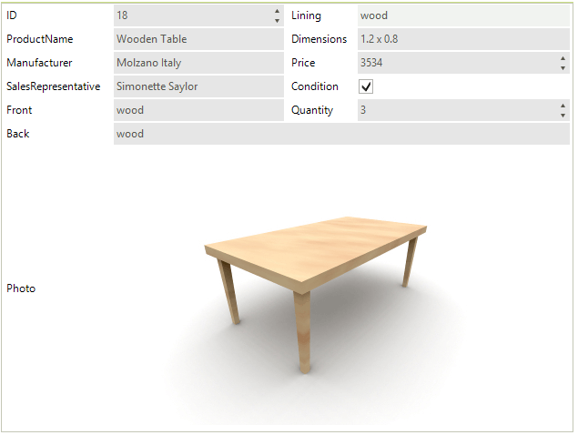

# Data Layout

The __RadDataLayout__ control provides means for displaying data in a highly customizable layout by automatically creating the items and editors and further allowing easy creating of complex layouts at design-time as well as at run-time.




        
>caption Figure 1: RadDataLayout.

__RadDataLayout__ generates different editors depending on the type of the properties coming from the data bound object.
         
* __RadTextBox__: Works with string properties

* __RadCheckBox__: Handles boolean values

* __RadDateTimePicker__: Responsible for dates

* __RadDropDownList__: Displays enum values

* __RadColorBox__: Handles color

* __PictureBox__: Edits images

# See Also

 * [Structure]()
 * [Getting Started]()
 * [Properties, events and attributes]()
 * [Localization]()
 * [Change the editor to RadDropDownList]()
 * [Customizing Appearance ]()
