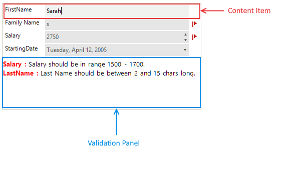
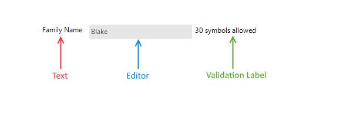

# Control Element Structure 

__RadDataLayout__ uses the [RadLayoutControl]() to create and arrange its items. There is embedded *Validation Panel* that can be used to show some additional information according to the validation requirements. The figure below demonstrates the structure of __RadDataLayout__.

>caption Figure 1: RadDataLayout structure

__RadDataLayout__ generates content item for each public property that can be edited. These items represent one 
*DataLayoutControlItem*. This item has display text, contains the editor control and a small validation label.

>caption Figure 2: Single item structure

The *Validation label* does not have any text by default. It is designed to be used in cases where users want to show some additional information. 

# See Also

 * [Localization]()
 * [Getting Started]()
 * [Properties, events and attributes]()
 * [Change the editor to RadDropDownList]()
 * [Customizing Appearance ]()
