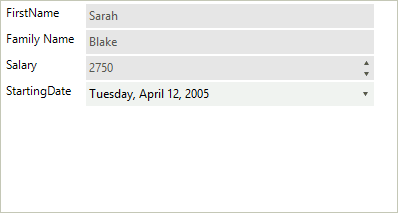
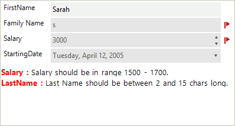

# Validation

For the need of the validation process we made two events (__ItemValidating, ItemValidated__) that are firing when the __Validating__ and __Validated__ events occur in the editors. __RadDataLayout__ provides three different ways to show to the users that some editors do not match the validation criteria – *Validation Label*, *Error Provider* and *Validation Panel*. In the following tutorial we will demonstrate how to use a validation panel together with Error provider.

1\. For the purpose of this tutorial, we will create a new class **Employee** with a couple of exposed properties. By binding __RadDataLayout__ to object from this type we will generate several items:

<snippet id='datalayout-validation-datalayoutemployee-cs' />
<snippet id='datalayout-validation-datalayoutemployee-vb' />

<snippet id='datalayout-validation-datalayoutbinding-cs' />
<snippet id='datalayout-validation-datalayoutbinding-vb' />

>caption Figure 1: RadDataLayout Initialized

2\. Set the __ShowValidationPanel__ property to *true*. This will display the panel below the editors:

<snippet id='datalayout-validation-datalayoutshowpanel-cs' />
<snippet id='datalayout-validation-datalayoutshowpanel-vb' />

3\. Set a padding to the __LayoutControlContainerElement__ so that the error icons are visible. A suitable place to perform this operation is the handler of the __BindingCreated__.

<snippet id='datalayout-validation-datalayoutsetpadding-cs' />
<snippet id='datalayout-validation-datalayoutsetpadding-vb' />

4\. Subscribe to the __ItemValidated__ event of __RadDataEntry__:

<snippet id='datalayout-validation-datalayoutitemvalidated-cs' />
<snippet id='datalayout-validation-datalayoutitemvalidated-vb' />

>caption Figure 2: Validaton Errors

In this tutorial we also used an error provider to show error icon next to the editors. You can read more about Microsoft Error provider here - [ErrorProvider Class](http://msdn.microsoft.com/en-us/library/system.windows.forms.errorprovider%28v=vs.110%29.aspx)

# See Also

 * [Structure]()
 * [Getting Started]()
 * [Properties, events and attributes]()
 * [Localization]()
 * [Change the editor to RadDropDownList]()
 * [Customizing Appearance ]()
