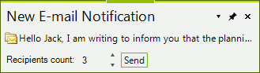

# Button Items

__RadDesktopAlert__ supports adding custom items to the pop up by using the __ButtonItems__ collection. The following example demonstrates how to add a label, a spin editor and a button element at the bottom of the alert:

>caption Figure 1: RadDesktopAlert's button items


 
#### Adding elements to the ButtonItems collection

{{source=..\SamplesCS\DesktopAlert\DesktopAlert1.cs region=ButtonItems}} 
{{source=..\SamplesVB\DesktopAlert\DesktopAlert1.vb region=ButtonItems}} 

````C#
    
public void AddButtonItems()
{
    RadLabelElement labelElement = new RadLabelElement();
    labelElement.Text = "Recipients count: ";
    labelElement.Padding = new System.Windows.Forms.Padding(0, 5, 0, 0);
    RadButtonElement buttonElement = new RadButtonElement();
    buttonElement.Text = "Send";
    buttonElement.Click += ButtonElement_Click;
    RadSpinEditorElement spinElement = new RadSpinEditorElement();
    spinElement.MinSize = new Size(50, 20);
    this.radDesktopAlert1.ButtonItems.Add(labelElement);
    this.radDesktopAlert1.ButtonItems.Add(spinElement);
    this.radDesktopAlert1.ButtonItems.Add(buttonElement);
}
    
private void ButtonElement_Click(object sender, EventArgs e)
{
    //TODO
}

````
````VB.NET
Public Sub AddButtonItems()
    Dim labelElement As New RadLabelElement()
    labelElement.Text = "Recipients count: "
    labelElement.Padding = New System.Windows.Forms.Padding(0, 5, 0, 0)
    Dim buttonElement As New RadButtonElement()
    buttonElement.Text = "Send"
    AddHandler buttonElement.Click, AddressOf ButtonElement_Click
    Dim spinElement As New RadSpinEditorElement()
    spinElement.MinSize = New Size(50, 20)
    Me.radDesktopAlert1.ButtonItems.Add(labelElement)
    Me.radDesktopAlert1.ButtonItems.Add(spinElement)
    Me.radDesktopAlert1.ButtonItems.Add(buttonElement)
End Sub
Private Sub ButtonElement_Click(sender As Object, e As EventArgs)
'TODO
End Sub

````

{{endregion}} 
