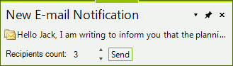

# Button Items

__RadDesktopAlert__ supports adding custom items to the pop up by using the __ButtonItems__ collection. The following example demonstrates how to add a label, a spin editor and a button element at the bottom of the alert:

>caption Figure 1: RadDesktopAlert's button items

 
#### Adding elements to the ButtonItems collection

<snippet id='desktopalert-button-items-buttonitems-cs'/>
<snippet id='desktopalert-button-items-buttonitems-vb'/>

 
