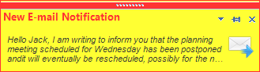

# Accessing and Customizing Elements
 
Accessing and customizing elements can be performed at run time. Before proceeding with this topic, it is recommended to get familiar with the [visual structure]() of the __RadDesktopAlert__.

The following code example demonstrates how to customize the nested elements at run time:

>caption Figure 1: Customize elements



#### Customize elements 

{{source=..\SamplesCS\DesktopAlert\DesktopAlert1.cs region=AccessingCustomizingElements}} 
{{source=..\SamplesVB\DesktopAlert\DesktopAlert1.vb region=AccessingCustomizingElements}} 

````C#
            
this.radDesktopAlert1.Popup.AlertElement.CaptionElement.TextAndButtonsElement.TextElement.ForeColor = Color.Red;
this.radDesktopAlert1.Popup.AlertElement.CaptionElement.CaptionGrip.BackColor = Color.Red;
this.radDesktopAlert1.Popup.AlertElement.CaptionElement.CaptionGrip.GradientStyle = GradientStyles.Solid;
this.radDesktopAlert1.Popup.AlertElement.ContentElement.Font = new Font("Arial", 8f,FontStyle.Italic);
this.radDesktopAlert1.Popup.AlertElement.ContentElement.TextImageRelation = TextImageRelation.TextBeforeImage;
this.radDesktopAlert1.Popup.AlertElement.BackColor = Color.Yellow;
this.radDesktopAlert1.Popup.AlertElement.GradientStyle = GradientStyles.Solid;
this.radDesktopAlert1.Popup.AlertElement.BorderColor = Color.Red;

````
````VB.NET
Me.radDesktopAlert1.Popup.AlertElement.CaptionElement.TextAndButtonsElement.TextElement.ForeColor = Color.Red
Me.radDesktopAlert1.Popup.AlertElement.CaptionElement.CaptionGrip.BackColor = Color.Red
Me.radDesktopAlert1.Popup.AlertElement.CaptionElement.CaptionGrip.GradientStyle = GradientStyles.Solid
Me.radDesktopAlert1.Popup.AlertElement.ContentElement.Font = New Font("Arial", 8.0F, FontStyle.Italic)
Me.radDesktopAlert1.Popup.AlertElement.ContentElement.TextImageRelation = TextImageRelation.TextBeforeImage
Me.radDesktopAlert1.Popup.AlertElement.BackColor = Color.Yellow
Me.radDesktopAlert1.Popup.AlertElement.GradientStyle = GradientStyles.Solid
Me.radDesktopAlert1.Popup.AlertElement.BorderColor = Color.Red
'#End Region
End Sub
'#region showingAlert
Private Sub radButton1_Click(ByVal sender As Object, ByVal e As EventArgs)
Me.radDesktopAlert1.ContentImage = envelopeImage
Me.radDesktopAlert1.CaptionText = "New E-mail Notification"
Me.radDesktopAlert1.ContentText = "Hello Jack, I am writing to inform you " & "that the planning meeting scheduled for Wednesday has been postponed and" & "it will eventually be rescheduled, possibly for the next Tuesday"
Me.radDesktopAlert1.Show()
End Sub

````

{{endregion}} 
