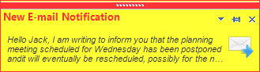

# Accessing and Customizing Elements
 
Accessing and customizing elements can be performed at run time. Before proceeding with this topic, it is recommended to get familiar with the [visual structure]() of the __RadDesktopAlert__.

The following code example demonstrates how to customize the nested elements at run time:

>caption Figure 1: Customize elements

#### Customize elements 

<snippet id='desktopalert-accessing-and-customizing-elements-accessingcustomizingelements-cs'/>
<snippet id='desktopalert-accessing-and-customizing-elements-accessingcustomizingelements-vb'/>

 
