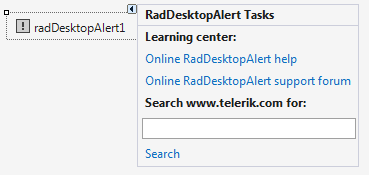

# Design Time

To start using __RadDesktopAlert__ just drag it from the toolbox and drop it at the form.

## Smart Tag

Select __RadDesktopAlert__ and click the small arrow on the top right position in order to open the Smart Tag.

>caption Figure 1: Smart Tag

* __Learning Center__: Navigate to the Telerik help, code library projects or support forum.

* __Search__: Search the Telerik site for a given string.
