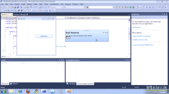
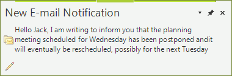

# WinForms DesktopAlert Overview

| RELATED VIDEOS |  |
| ------ | ------ |
|[WinForms RadDesktopAlert Getting Started with RadDesktopAlert](http://tv.telerik.com/watch/winforms/getting-started-with-raddesktopalert) In this video, you will learn how to get started with RadDesktopAlert.||

__RadDesktopAlert__ component displays a small pop-up window on the screen to notify the user that a specific event has occurred in the application. The component exposes a convenient API for modifying its behavior, appearance and also can be easily styled in the Visual Style Builder. __RadDesktopAlert__ supports multi-monitor environments via __DesktopAlertManager__. __DesktopAlertManager__ takes care for the proper positioning of multiple __RadDesktopAlert__ instances on the screen estate so that it is optimally used. __RadDesktopAlert__ can be easily integrated in a Windows Forms application. It is available as a component in the Telerik UI for WinForms suite and can be dragged and dropped on a Windows Forms from the Visual Studio Toolbox.





>caption Figure 1: RadDesktopAlert
>

## Telerik UI for WinForms Learning Resources
* [Telerik UI for WinForms DesktopAlert Homepage](https://www.telerik.com/products/winforms/desktopalert.aspx)
* [Get Started with the Telerik UI for WinForms DesktopAlert]()
* [Telerik UI for WinForms API Reference](https://docs.telerik.com/devtools/winforms/api/)
* [Getting Started with Telerik UI for WinForms Components]()
* [Telerik UI for WinForms Virtual Classroom (Training Courses for Registered Users)](https://learn.telerik.com/learn/course/external/view/elearning/17/TelerikUIforWinForms) 
* [Telerik UI for WinForms Forum](https://www.telerik.com/forums/winforms)
* [Telerik UI for WinForms Knowledge Base](https://docs.telerik.com/devtools/winforms/knowledge-base)

# See Also

* [Design Time]()
* [Getting Started]()
