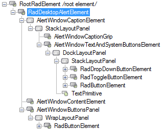
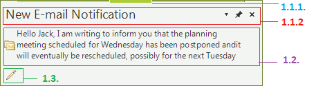

# Structure

This article describes the inner structure and organization of the elements which build the __RadDesktopAlert__ component.

>caption Figure 1: RadDesktopAlert's elements hierarchy

>caption Figure 2: RadDesktopAlert's structure

1. __RadDesktopAlertElement__: represents the main element of a __RadDesktopAlert__  
  1\.1\. __AlertWindowCaptionElement__: represents the caption of a __RadDesktopAlert__. It contains a caption grip which is used to move the alert window, close button and options drop-down button.   
&nbsp;&nbsp;&nbsp;&nbsp;&nbsp;1\.1\.1\. __AlertWindowCaptionGrip__: represents the part of a __RadDesktopAlert__ that can be used to move the component on the screen. 
&nbsp;&nbsp;&nbsp;&nbsp;&nbsp;1\.1\.2\. __AlertWindowTextAndSystemButtonsElement__: represents the part of a __RadDesktopAlert__ that contains the text and the system buttons. 
  1\.2\. __AlertWindowContentElement__: represents the content of a __RadDesktopAlert__ component.The content usually is built of an image and HTML enabled text.  
  1\.3\. __AlertWindowButtonsPanel__: represents the element which holds the buttons that can be added in a __RadDesktopAlert__ window. 

# See Also

* [RadControlSpy]()
