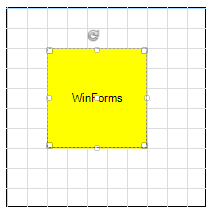
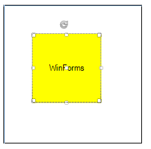
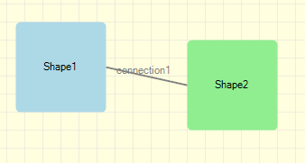
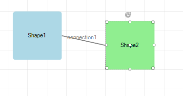
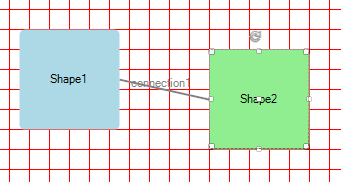
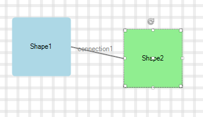

# Background Grid

You can control the background settings of the diagramming surface through the following properties:
        

* __IsBackgroundSurfaceVisible__: a boolean property that determines whether the background surface of the __RadDiagram__  should be displayed. Its default value is *true*. 

#### Set IsBackgroundSurfaceVisible

<snippet id='diagram-background-grid-isbackgroundsurfacevisible-cs' />
<snippet id='diagram-background-grid-isbackgroundsurfacevisible-vb' />

| __IsBackgroundSurfaceVisible__ = *true* | __IsBackgroundSurfaceVisible__ = *false* |
|----|----|
|||

* __Background__: this property is of type *Brush* and it controls the fill of the __RadDiagram__ background.

#### Set Background         

<snippet id='diagram-background-grid-background-cs' />
<snippet id='diagram-background-grid-background-vb' />

>caption Figure 1: Background

You can access the __BackgroundGrid__ properties:

* __CellSize__: this property is of type *Telerik.Windows.Diagrams.Core.Size* and it controls the size of the cells in the __RadDiagram__ surface. The default value of this property is a size of *20x20 * units.
            
>caption Figure 2: CellSize

#### Set CellSize 
 
<snippet id='diagram-background-grid-cellsize-cs' />
<snippet id='diagram-background-grid-cellsize-vb' />

 
* __LineStroke__: this property is of type *Brush* and it specifies how the cells outline is painted.
            
>caption Figure 3: LineStroke

  

#### Set LineStroke

<snippet id='diagram-background-grid-linestroke-cs' />
<snippet id='diagram-background-grid-linestroke-vb' />

 
* __LineStrokeThickness__: this property is of type *double* and it gets or sets the thickness of the __RadDiagram__ background grid lines.
            
>caption Figure 4: LineStrokeThickness

 

#### Set LineStrokeThickness

<snippet id='diagram-background-grid-linestrokethickness-cs' />
<snippet id='diagram-background-grid-linestrokethickness-vb' />

# See Also

* [RibbonUI]()	
* [Settings Pane]()	
* [Toolbox]()

