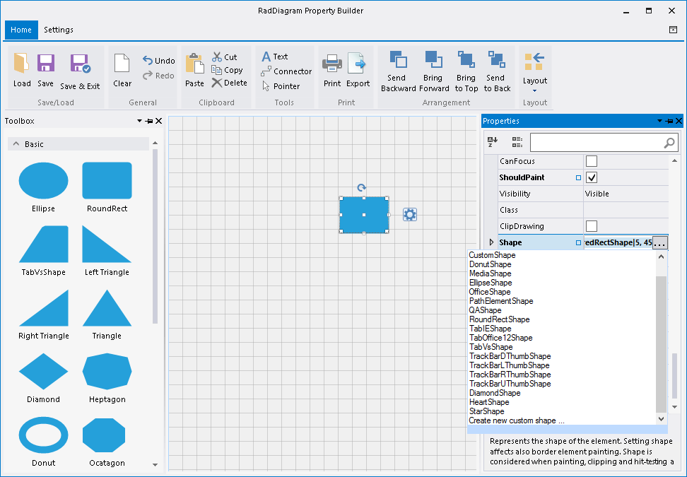
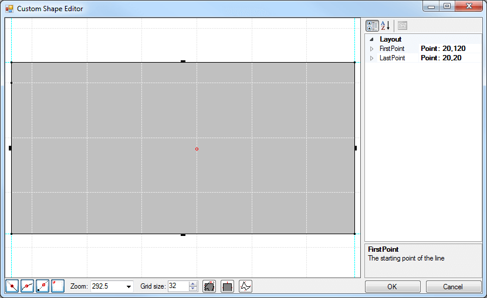

# Custom shapes

This tutorial will guide you through the task of creating a custom shape.

## Creating custom shapes programmatically

In order to create a custom shape, you need to define a custom shape class deriving from the __ElementShape__ class. Overriding its __CreatePath__ method you can define the desired shape. Afterwards, you need to apply your shape implementation to the RadDiagramShape.__ElementShape__ property: 

<snippet id='diagram-custom-shapes-myshape-cs' />
<snippet id='diagram-custom-shapes-myshape-vb' />

<snippet id='diagram-custom-shapes-applycustomshape-cs' />
<snippet id='diagram-custom-shapes-applycustomshape-vb' />

## Creating custom shapes by the Custom Shape Editor

When you open the RadDiagram Property Builder from the Smart Tag and drag a shape from the toolbox you can customize the default shape  by editing the __ElementShape__ property and selecting the *Create new custom shape ...* option from the list:

This will display the [Custom Shape Editor]().
        

# See Also

* [ShapeEditor Tool]()
