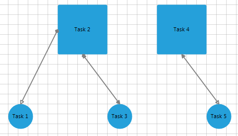

# Binding to Custom Objects

In this article you can check how to data bind __RadDiagram__ by using custom objects.
    

The data source should contain columns/fields that represent the shapes/connections collections. Each of the objects that illustrates the shape/connection should have columns/fields for each of the diagram fields that you want to specify. For example, if you want to pull the width of the shape from the data source, this will require a separate column/field that contains the widths of each shape.
        

Consider the following classes: 

<snippet id='diagram-binding-to-custom-objects-customobjects-cs' />
<snippet id='diagram-binding-to-custom-objects-customobjects-vb' />

The __Task__ class will represent a single shape in __RadDiagram__, while the __Relation__ class will represent a connection. Note that the __Source__ class contains two properties, __Tasks__ and __Relations__ which will be specified as __ConnectionDataMember__ and __ShapeDataMember__ for __RadDiagram__. To make data binding work, you should specify the member properties as well: 

<snippet id='diagram-binding-to-custom-objects-setupmembers-cs' />
<snippet id='diagram-binding-to-custom-objects-setupmembers-vb' />

