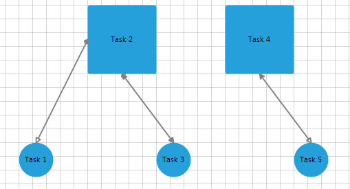

# Data Binding Basics

In this article you can check how to data bind __RadDiagram__. To make data binding work, minimally you must assign the __DataSource__ property of __RadDiagram__ and the member properties explained below.


* __ConnectionDataMember__ - set this to the field that holds the collection of data that will be used to populate the connections.
            

* __ShapeDataMember__ - set this to the field that holds the collection of data that will be used to populate the shapes.
            

* __ShapeIdMember__ - set this to the name of the field that will be used as id for the shapes.
            

* __ShapeTextMember__ - set this to the name of the field that will be used as text for the shapes.
            

* __ShapeTypeMember__ - set this to the name of the field that will be used as a shape for the shapes.
            

* __ShapeXMember__ - set this to the name of the field that will be used as X location for the shapes.
            

* __ShapeYMember__ - set this to the name of the field that will be used as Y location for the shapes.
            

* __ShapeWidthMember__ - set this to the name of the field that will be used as width for the shapes.
            

* __ShapeHeightMember__ - set this to the name of the field that will be used as height for the shapes.
            

* __ConnectionSourceShapeIdMember__ – set this to the name of the field that will be used as id for the source shape for a connection.
            

* __ConnectionTargetShapeIdMember__ – set this to the name of the field that will be used as id for the target shape for a connection.
            

* __ConnectionSourceCapTypeMember__ – set this to the name of the field that will be used as cap type for the source shape for a connection.
            

* __ConnectionTargetCapTypeMember__ – set this to the name of the field that will be used as cap type for the target shape for a connection.
            

* __ConnectionSourceConnectorMember__ – set this to the name of the field that will be used as connector for the source shape for a connection.
            

* __ConnectionTargetConnectorMember__ – set this to the name of the field that will be used as connector for the target shape for a connection. 

{{source=..\SamplesCS\Diagram\DiagramDataBinding.cs region=DataTable}} 
{{source=..\SamplesVB\Diagram\DiagramDataBinding.vb region=DataTable}} 

````C#
            
DataTable tasksTable = new DataTable("Tasks");   
tasksTable.Columns.Add("Id");
tasksTable.Columns.Add("Text");
tasksTable.Columns.Add("Type");
tasksTable.Columns.Add("X");
tasksTable.Columns.Add("Y");
tasksTable.Columns.Add("Width");
tasksTable.Columns.Add("Height");
tasksTable.Rows.Add("Task1", "Task 1", "circle", 100, 300, 50, 50);
tasksTable.Rows.Add("Task2", "Task 2", "rectangle", 200, 100, 100, 100);
tasksTable.Rows.Add("Task3", "Task 3", "circle", 300, 300, 50, 50);
tasksTable.Rows.Add("Task4", "Task 4", "rectangle", 400, 100, 100, 100);
tasksTable.Rows.Add("Task5", "Task 5", "circle", 500, 300, 50, 50);
            
DataTable relationsTable = new DataTable("Relations");
relationsTable.Columns.Add("SourceTaskId");
relationsTable.Columns.Add("SourceConnector");
relationsTable.Columns.Add("TargetTaskId");
relationsTable.Columns.Add("TargetConnector");
relationsTable.Columns.Add("StartCapField");
relationsTable.Columns.Add("EndCapField");
relationsTable.Rows.Add("Task2", "Left", "Task1", "Auto", "Arrow5Filled", "Arrow1");
relationsTable.Rows.Add("Task2", "Auto", "Task3", "Auto", "Arrow4Filled", "Arrow1Filled");
relationsTable.Rows.Add("Task4", "Auto", "Task5", "Auto", "Arrow2Filled", "Arrow2");
            
DataSet ds = new DataSet();
ds.Tables.Add(tasksTable);
ds.Tables.Add(relationsTable);
            
this.radDiagram1.DataSource = ds;
            
this.radDiagram1.ConnectionDataMember = "Relations";
this.radDiagram1.ShapeDataMember = "Tasks";
this.radDiagram1.ShapeIdMember = "Id";  
this.radDiagram1.ShapeTextMember = "Text";
this.radDiagram1.ShapeTypeMember = "Type";
this.radDiagram1.ShapeXMember = "X";
this.radDiagram1.ShapeYMember = "Y";
this.radDiagram1.ShapeWidthMember = "Width";
this.radDiagram1.ShapeHeightMember = "Height";
            
this.radDiagram1.ConnectionSourceShapeIdMember = "SourceTaskId";
this.radDiagram1.ConnectionTargetShapeIdMember = "TargetTaskId";
this.radDiagram1.ConnectionSourceCapTypeMember = "StartCapField";
this.radDiagram1.ConnectionTargetCapTypeMember = "EndCapField";
            
this.radDiagram1.ConnectionSourceConnectorMember = "SourceConnector";
this.radDiagram1.ConnectionTargetConnectorMember = "TargetConnector";

````
````VB.NET
Dim tasksTable As New DataTable("Tasks")
tasksTable.Columns.Add("Id")
tasksTable.Columns.Add("Text")
tasksTable.Columns.Add("Type")
tasksTable.Columns.Add("X")
tasksTable.Columns.Add("Y")
tasksTable.Columns.Add("Width")
tasksTable.Columns.Add("Height")
tasksTable.Rows.Add("Task1", "Task 1", "circle", 100, 300, 50, 50)
tasksTable.Rows.Add("Task2", "Task 2", "rectangle", 200, 100, 100, 100)
tasksTable.Rows.Add("Task3", "Task 3", "circle", 300, 300, 50, 50)
tasksTable.Rows.Add("Task4", "Task 4", "rectangle", 400, 100, 100, 100)
tasksTable.Rows.Add("Task5", "Task 5", "circle", 500, 300, 50, 50)
Dim relationsTable As New DataTable("Relations")
relationsTable.Columns.Add("SourceTaskId")
relationsTable.Columns.Add("SourceConnector")
relationsTable.Columns.Add("TargetTaskId")
relationsTable.Columns.Add("TargetConnector")
relationsTable.Columns.Add("StartCapField")
relationsTable.Columns.Add("EndCapField")
relationsTable.Rows.Add("Task2", "Left", "Task1", "Auto", "Arrow5Filled", "Arrow1")
relationsTable.Rows.Add("Task2", "Auto", "Task3", "Auto", "Arrow4Filled", "Arrow1Filled")
relationsTable.Rows.Add("Task4", "Auto", "Task5", "Auto", "Arrow2Filled", "Arrow2")
Dim ds As New DataSet()
ds.Tables.Add(tasksTable)
ds.Tables.Add(relationsTable)
Me.RadDiagram1.DataSource = ds
Me.RadDiagram1.ConnectionDataMember = "Relations"
Me.RadDiagram1.ShapeDataMember = "Tasks"
Me.RadDiagram1.ShapeIdMember = "Id"
Me.RadDiagram1.ShapeTextMember = "Text"
Me.RadDiagram1.ShapeTypeMember = "Type"
Me.RadDiagram1.ShapeXMember = "X"
Me.RadDiagram1.ShapeYMember = "Y"
Me.RadDiagram1.ShapeWidthMember = "Width"
Me.RadDiagram1.ShapeHeightMember = "Height"
Me.RadDiagram1.ConnectionSourceShapeIdMember = "SourceTaskId"
Me.RadDiagram1.ConnectionTargetShapeIdMember = "TargetTaskId"
Me.RadDiagram1.ConnectionSourceCapTypeMember = "StartCapField"
Me.RadDiagram1.ConnectionTargetCapTypeMember = "EndCapField"
Me.RadDiagram1.ConnectionSourceConnectorMember = "SourceConnector"
Me.RadDiagram1.ConnectionTargetConnectorMember = "TargetConnector"

````

{{endregion}} 



