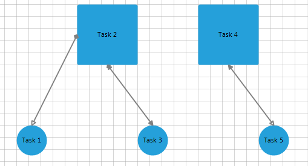

# Data Binding Basics

In this article you can check how to data bind __RadDiagram__. To make data binding work, minimally you must assign the __DataSource__ property of __RadDiagram__ and the member properties explained below.

* __ConnectionDataMember__ - set this to the field that holds the collection of data that will be used to populate the connections.
            

* __ShapeDataMember__ - set this to the field that holds the collection of data that will be used to populate the shapes.
            

* __ShapeIdMember__ - set this to the name of the field that will be used as id for the shapes.
            

* __ShapeTextMember__ - set this to the name of the field that will be used as text for the shapes.
            

* __ShapeTypeMember__ - set this to the name of the field that will be used as a shape for the shapes.
            

* __ShapeXMember__ - set this to the name of the field that will be used as X location for the shapes.
            

* __ShapeYMember__ - set this to the name of the field that will be used as Y location for the shapes.
            

* __ShapeWidthMember__ - set this to the name of the field that will be used as width for the shapes.
            

* __ShapeHeightMember__ - set this to the name of the field that will be used as height for the shapes.
            

* __ConnectionSourceShapeIdMember__ – set this to the name of the field that will be used as id for the source shape for a connection.
            

* __ConnectionTargetShapeIdMember__ – set this to the name of the field that will be used as id for the target shape for a connection.
            

* __ConnectionSourceCapTypeMember__ – set this to the name of the field that will be used as cap type for the source shape for a connection.
            

* __ConnectionTargetCapTypeMember__ – set this to the name of the field that will be used as cap type for the target shape for a connection.
            

* __ConnectionSourceConnectorMember__ – set this to the name of the field that will be used as connector for the source shape for a connection.
            

* __ConnectionTargetConnectorMember__ – set this to the name of the field that will be used as connector for the target shape for a connection. 

<snippet id='diagram-data-binding-basics-datatable-cs' />
<snippet id='diagram-data-binding-basics-datatable-vb' />

