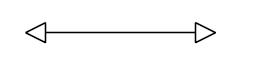
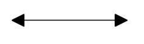
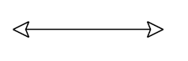
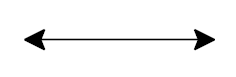
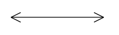
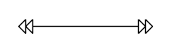
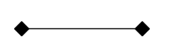
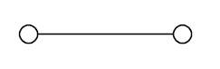
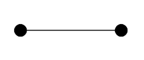

# Cap Types

__CapType__ enumeration members:

* __None__:

 

{{source=..\SamplesCS\Diagram\DiagramItems.cs region=CapTypeNone}} 
{{source=..\SamplesVB\Diagram\DiagramItems.vb region=CapTypeNone}} 

````C#
            
connection1.SourceCapType = Telerik.Windows.Diagrams.Core.CapType.None;
connection1.TargetCapType = Telerik.Windows.Diagrams.Core.CapType.None;

````
````VB.NET
connection1.SourceCapType = Telerik.Windows.Diagrams.Core.CapType.None
connection1.TargetCapType = Telerik.Windows.Diagrams.Core.CapType.None

````

{{endregion}} 


* __Arrow1__:

 

{{source=..\SamplesCS\Diagram\DiagramItems.cs region=CapTypeArrow1}} 
{{source=..\SamplesVB\Diagram\DiagramItems.vb region=CapTypeArrow1}} 

````C#
connection1.SourceCapType = Telerik.Windows.Diagrams.Core.CapType.Arrow1;
connection1.TargetCapType = Telerik.Windows.Diagrams.Core.CapType.Arrow1;

````
````VB.NET
connection1.SourceCapType = Telerik.Windows.Diagrams.Core.CapType.Arrow1
connection1.TargetCapType = Telerik.Windows.Diagrams.Core.CapType.Arrow1

````

{{endregion}} 


* __Arrow1Filled__:

 


{{source=..\SamplesCS\Diagram\DiagramItems.cs region=CapTypeArrow1Filled}} 
{{source=..\SamplesVB\Diagram\DiagramItems.vb region=CapTypeArrow1Filled}} 

````C#
            
connection1.SourceCapType = Telerik.Windows.Diagrams.Core.CapType.Arrow1Filled;
connection1.TargetCapType = Telerik.Windows.Diagrams.Core.CapType.Arrow1Filled;

````
````VB.NET
connection1.SourceCapType = Telerik.Windows.Diagrams.Core.CapType.Arrow1Filled
connection1.TargetCapType = Telerik.Windows.Diagrams.Core.CapType.Arrow1Filled

````

{{endregion}} 


* __Arrow2__:

 

{{source=..\SamplesCS\Diagram\DiagramItems.cs region=CapTypeArrow2}} 
{{source=..\SamplesVB\Diagram\DiagramItems.vb region=CapTypeArrow2}} 

````C#
            
connection1.SourceCapType = Telerik.Windows.Diagrams.Core.CapType.Arrow2;
connection1.TargetCapType = Telerik.Windows.Diagrams.Core.CapType.Arrow2;

````
````VB.NET
connection1.SourceCapType = Telerik.Windows.Diagrams.Core.CapType.Arrow2
connection1.TargetCapType = Telerik.Windows.Diagrams.Core.CapType.Arrow2

````

{{endregion}} 


* __Arrow2Filled__:

 
 
{{source=..\SamplesCS\Diagram\DiagramItems.cs region=CapTypeArrow2Filled}} 
{{source=..\SamplesVB\Diagram\DiagramItems.vb region=CapTypeArrow2Filled}} 

````C#
connection1.SourceCapType = Telerik.Windows.Diagrams.Core.CapType.Arrow2Filled;
connection1.TargetCapType = Telerik.Windows.Diagrams.Core.CapType.Arrow2Filled;

````
````VB.NET
connection1.SourceCapType = Telerik.Windows.Diagrams.Core.CapType.Arrow2Filled
connection1.TargetCapType = Telerik.Windows.Diagrams.Core.CapType.Arrow2Filled

````

{{endregion}} 
 

* __Arrow3__:

 

{{source=..\SamplesCS\Diagram\DiagramItems.cs region=CapTypeArrow3}} 
{{source=..\SamplesVB\Diagram\DiagramItems.vb region=CapTypeArrow3}} 

````C#
    
connection1.SourceCapType = Telerik.Windows.Diagrams.Core.CapType.Arrow3;
connection1.TargetCapType = Telerik.Windows.Diagrams.Core.CapType.Arrow3;

````
````VB.NET
connection1.SourceCapType = Telerik.Windows.Diagrams.Core.CapType.Arrow3
connection1.TargetCapType = Telerik.Windows.Diagrams.Core.CapType.Arrow3

````

{{endregion}} 
 

* __Arrow4__:

 
 
{{source=..\SamplesCS\Diagram\DiagramItems.cs region=CapTypeArrow4}} 
{{source=..\SamplesVB\Diagram\DiagramItems.vb region=CapTypeArrow4}} 

````C#
    
connection1.SourceCapType = Telerik.Windows.Diagrams.Core.CapType.Arrow4;
connection1.TargetCapType = Telerik.Windows.Diagrams.Core.CapType.Arrow4;

````
````VB.NET
connection1.SourceCapType = Telerik.Windows.Diagrams.Core.CapType.Arrow4
connection1.TargetCapType = Telerik.Windows.Diagrams.Core.CapType.Arrow4

````

{{endregion}} 


* __Arrow4Filled__:

 
 

{{source=..\SamplesCS\Diagram\DiagramItems.cs region=CapTypeArrow4Filled}} 
{{source=..\SamplesVB\Diagram\DiagramItems.vb region=CapTypeArrow4Filled}} 

````C#
    
connection1.SourceCapType = Telerik.Windows.Diagrams.Core.CapType.Arrow4Filled;
connection1.TargetCapType = Telerik.Windows.Diagrams.Core.CapType.Arrow4Filled;

````
````VB.NET
connection1.SourceCapType = Telerik.Windows.Diagrams.Core.CapType.Arrow4Filled
connection1.TargetCapType = Telerik.Windows.Diagrams.Core.CapType.Arrow4Filled

````

{{endregion}} 


* __Arrow5__:

 

{{source=..\SamplesCS\Diagram\DiagramItems.cs region=CapTypeArrow5}} 
{{source=..\SamplesVB\Diagram\DiagramItems.vb region=CapTypeArrow5}} 

````C#
    
connection1.SourceCapType = Telerik.Windows.Diagrams.Core.CapType.Arrow5;
connection1.TargetCapType = Telerik.Windows.Diagrams.Core.CapType.Arrow5;

````
````VB.NET
connection1.SourceCapType = Telerik.Windows.Diagrams.Core.CapType.Arrow5
connection1.TargetCapType = Telerik.Windows.Diagrams.Core.CapType.Arrow5

````

{{endregion}} 


* __Arrow5Filled__:

 

{{source=..\SamplesCS\Diagram\DiagramItems.cs region=CapTypeArrow5Filled}} 
{{source=..\SamplesVB\Diagram\DiagramItems.vb region=CapTypeArrow5Filled}} 

````C#
    
connection1.SourceCapType = Telerik.Windows.Diagrams.Core.CapType.Arrow5Filled;
connection1.TargetCapType = Telerik.Windows.Diagrams.Core.CapType.Arrow5Filled;

````
````VB.NET
connection1.SourceCapType = Telerik.Windows.Diagrams.Core.CapType.Arrow5Filled
connection1.TargetCapType = Telerik.Windows.Diagrams.Core.CapType.Arrow5Filled

````

{{endregion}} 

* __Arrow6__:

 

{{source=..\SamplesCS\Diagram\DiagramItems.cs region=CapTypeArrow6}} 
{{source=..\SamplesVB\Diagram\DiagramItems.vb region=CapTypeArrow6}} 

````C#
    
connection1.SourceCapType = Telerik.Windows.Diagrams.Core.CapType.Arrow6;
connection1.TargetCapType = Telerik.Windows.Diagrams.Core.CapType.Arrow6;

````
````VB.NET
connection1.SourceCapType = Telerik.Windows.Diagrams.Core.CapType.Arrow6
connection1.TargetCapType = Telerik.Windows.Diagrams.Core.CapType.Arrow6

````

{{endregion}} 


* __Arrow6Filled__:

 


{{source=..\SamplesCS\Diagram\DiagramItems.cs region=CapTypeArrow6Filled}} 
{{source=..\SamplesVB\Diagram\DiagramItems.vb region=CapTypeArrow6Filled}} 

````C#
    
connection1.SourceCapType = Telerik.Windows.Diagrams.Core.CapType.Arrow6Filled;
connection1.TargetCapType = Telerik.Windows.Diagrams.Core.CapType.Arrow6Filled;

````
````VB.NET
connection1.SourceCapType = Telerik.Windows.Diagrams.Core.CapType.Arrow6Filled
connection1.TargetCapType = Telerik.Windows.Diagrams.Core.CapType.Arrow6Filled

````

{{endregion}} 
