# Cap Types

__CapType__ enumeration members:

* __None__:

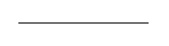 

<snippet id='diagram-cap-types-captypenone-cs' />
<snippet id='diagram-cap-types-captypenone-vb' />

* __Arrow1__:

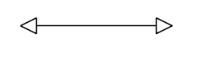 

<snippet id='diagram-cap-types-captypearrow1-cs' />
<snippet id='diagram-cap-types-captypearrow1-vb' />

* __Arrow1Filled__:

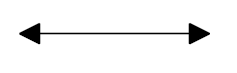 

<snippet id='diagram-cap-types-captypearrow1filled-cs' />
<snippet id='diagram-cap-types-captypearrow1filled-vb' />

* __Arrow2__:

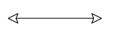 

<snippet id='diagram-cap-types-captypearrow2-cs' />
<snippet id='diagram-cap-types-captypearrow2-vb' />

* __Arrow2Filled__:

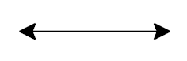 
 
<snippet id='diagram-cap-types-captypearrow2filled-cs' />
<snippet id='diagram-cap-types-captypearrow2filled-vb' />

 

* __Arrow3__:

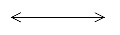 

<snippet id='diagram-cap-types-captypearrow3-cs' />
<snippet id='diagram-cap-types-captypearrow3-vb' />

 

* __Arrow4__:

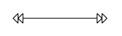 
 
<snippet id='diagram-cap-types-captypearrow4-cs' />
<snippet id='diagram-cap-types-captypearrow4-vb' />

* __Arrow4Filled__:

 
 

<snippet id='diagram-cap-types-captypearrow4filled-cs' />
<snippet id='diagram-cap-types-captypearrow4filled-vb' />

* __Arrow5__:

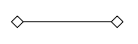 

<snippet id='diagram-cap-types-captypearrow5-cs' />
<snippet id='diagram-cap-types-captypearrow5-vb' />

* __Arrow5Filled__:

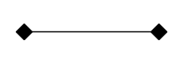 

<snippet id='diagram-cap-types-captypearrow5filled-cs' />
<snippet id='diagram-cap-types-captypearrow5filled-vb' />

* __Arrow6__:

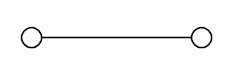 

<snippet id='diagram-cap-types-captypearrow6-cs' />
<snippet id='diagram-cap-types-captypearrow6-vb' />

* __Arrow6Filled__:

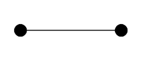 

<snippet id='diagram-cap-types-captypearrow6filled-cs' />
<snippet id='diagram-cap-types-captypearrow6filled-vb' />

