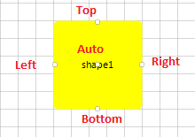
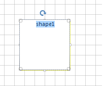
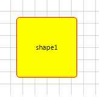
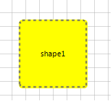
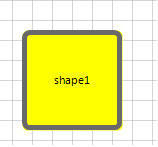

# Shapes

This tutorial will walk you through the functionality and the main features of __RadDiagramShape__.

>note Before proceeding with this topic, it is recommended to get familiar with the [visual structure]() of the __RadDiagram__ .
>

## RadDiagramShape

__RadDiagramShape__ is an object that describes the nodes of the diagram. You can configure its form using the __Shape__ property as it allows you to define a custom shape:

  

<snippet id='diagram-shapes-setashape-cs' />
<snippet id='diagram-shapes-setashape-vb' />

<snippet id='diagram-shapes-ashape-cs' />
<snippet id='diagram-shapes-ashape-vb' />

or to use one of the pre-defined shapes:

 

<snippet id='diagram-shapes-starshape-cs' />
<snippet id='diagram-shapes-starshape-vb' />

>note A list of pre-defined shapes is available here: [Shapes](https://docs.telerik.com/devtools/winforms/controls/diagram/diagram-items/shapes)
 
## Setting the Position of a Shape

The RadDiagramShape. __Position__ property is of type __Telerik.Windows.Diagrams.Core.Point__ and it gets or sets the coordinates of the top left point of a shape. By default, its value is a Point with coordinates (0,0).
        

## Content

You can add content in the __RadDiagramShape__ using its __Text__ property. It allows you to define the content as a string.
        

## Connectors

Each __RadDiagramShape__ has 5 default connectors - Top, Right, Bottom, Left and Auto. Those are the predefined points where you can connect a __RadDiagramConnection__ to the shape.
>caption Fig.3 Connectors

* __Top__- the connector point positioned in the middle of the top border of a shape
            

* __Bottom__- the connector point positioned in the middle of the bottom border of a shape
            

* __Right__- the connector point positioned in the middle of the right border of a shape
            

* __Left__- the connector point positioned in the middle of the left border of a shape
            

* __Auto__- the connector positioned at the center of a shape. If you attach a RadDiagramConnection to this point, the connector point of the connection will dynamically change based on the shortest path to the shape.
            

All connector points of a shape can be accessed through the RadDiagramShape.__Connectors__ property. It is a collection of __RadDiagramConnector__ items. Each item represents a __RadDiagramShape__ connector and can give you information about the coordinates of each connector point, its position and if the connector is active. A connector is active when the connection tool activates it in order to prepare it to start drawing a connection.

## Common Properties

The __RadDiagramShape__ class exposes multiple properties that allow you to control the state and appearance of a shape.
        

* __Shape Bounds__

	* __Bounds__- this property is of type Rect and it gets the width, height and location of the shape's bounds.
                

	* __ActualBounds__ - this property is of type Rect and it gets the width, height and location of a rotated shape's bounds.
                

* __Shape Connections__ - you can get all incoming and outgoing connections related to the shape through the following properties:

	* __IncomingLinks__- this property is an enumeration that gets all incoming connections. It gives you information about the connections type, starting and ending points as well as the related connector positions.
                

	* __OutgoingLinks__- this property is an enumeration that gets all outgoing connections. It gives you information about the connections type, starting and ending points as well as the related connector positions.
                

* __Rotation Angle__ - __RadDiagramShape__ supports rotation. You can get or set the rotation angle of a shape using the __RotationAngle__ property.

* __Edit Mode__ - you can set the __RadDiagramShape__ in edit mode using the __IsInEditMode__ property. By default, when a shape enters edit mode, the RadDiagramShape.__Text__ is displayed inside a __TextBox__ control so that you can change its value. 
`
>caption Figure 4: Edit mode

* __Shape Selection State__ - the __IsSelected__ property allows you to track and control the selection state of a shape.

* __Shape ZIndex__ - you can get or set the z-order rendering behavior of the __RadDiagramShape__ through the __ZIndex__ property.

## Customize the Shape Appearance

You can easily customize the visual appearance of the __RadDiagramShape__ by using the following properties:

* __BackColor__ - gets or sets the RadDiagramShape background color.
            

* __BorderBrush__- gets or sets the brush that specifies the __RadDiagramShape__ border color if the __DrawBorder__ property is set to *true*. 

<snippet id='diagram-shapes-shapeborder-cs' />
<snippet id='diagram-shapes-shapeborder-vb' />

>caption Figure 5: Shape border

* __StrokeDashArray__ - gets or sets a collection of Double values that indicate the pattern of dashes and gaps that is used to outline the __RadDiagramShape__.
            
<snippet id='diagram-shapes-borderstroke-cs' />
<snippet id='diagram-shapes-borderstroke-vb' />

>caption Figure 6: StrokeDashArray

* __StrokeThickness__- gets or sets the width of the __RadDiagramShape__ outline.
            
>caption Figure 7: StrokeThickness

# See Also
 
* [ContainerShapes]()	
* [Connections]()	
* [Custom shapes]()
