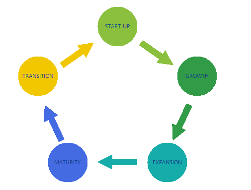
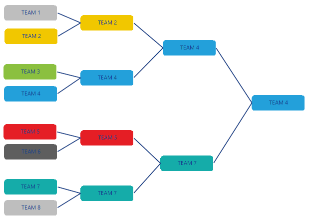

# WinForms Diagram Overview

__RadDiagram__ offers flexible and interactive diagramming layouts for your rich data-visualization applications. The framework tool set enables you to:

* Design work-flows in which case shapes and connections are tightly bound to an underlying API

* Simulate processes and represent data logic

* Architect data-visualization and data analysis diagramming structures

* Further enhance and customize your geographic maps solutions





## Diagram features

Here is a list with short descriptions of the top-of-the-line features of __RadDiagram__:

* __Extensive set of diagramming shapes__ - __RadDiagram__ exposes a set of predefined diagramming shapes.
            

* __Flexible diagramming connections__ - __RadDiagram__ exposes flexible diagram connections.

* __Items editing__ -  __RadDiagram__ supports editing the content of the diagramming elements.
            

* __Items rotation__ - __RadDiagram__ supports rotation.
            

* __Items resizing__ - __RadDiagram__ supports resizing.
          

* __Items ZOrder__ - __RadDiagram__ supports changing the z-order of its elements.
            

* __Items selection__ - __RadDiagram__ allows users to select one or multiple diagram elements at any time.
            

* __Clipboard operations__ - __RadDiagram__ supports Cut, Copy and Paste operations.
            

* __Undo and Redo__ - __RadDiagram__ supports Undo and Redo operations.
            

* __Serialization__ - __RadDiagram__ supports serializing and deserializing diagramming objects into and from XML documents.
            

* __Mouse tools__ - __RadDiagram__ exposes a set of mouse tools - selection and connection.
            

* __Diagram commands__ - __RadDiagram__ exposes a set of commands that allow you to easily implement interaction logic in MVVM solutions.

## Telerik UI for WinForms Learning Resources
* [Telerik UI for WinForms Diagram Homepage](https://www.telerik.com/products/winforms/diagram.aspx)
* [Get Started with the Telerik UI for WinForms Diagram]()
* [Telerik UI for WinForms API Reference](https://docs.telerik.com/devtools/winforms/api/)
* [Getting Started with Telerik UI for WinForms Components]()
* [Telerik UI for WinForms Virtual Classroom (Training Courses for Registered Users)](https://learn.telerik.com/learn/course/external/view/elearning/17/TelerikUIforWinForms) 
* [Telerik UI for WinForms Forum](https://www.telerik.com/forums/winforms)
* [Telerik UI for WinForms Knowledge Base](https://docs.telerik.com/devtools/winforms/knowledge-base)

# See Also

* [Structure]()
* [Design Time]()
* [Getting Started]()
          
