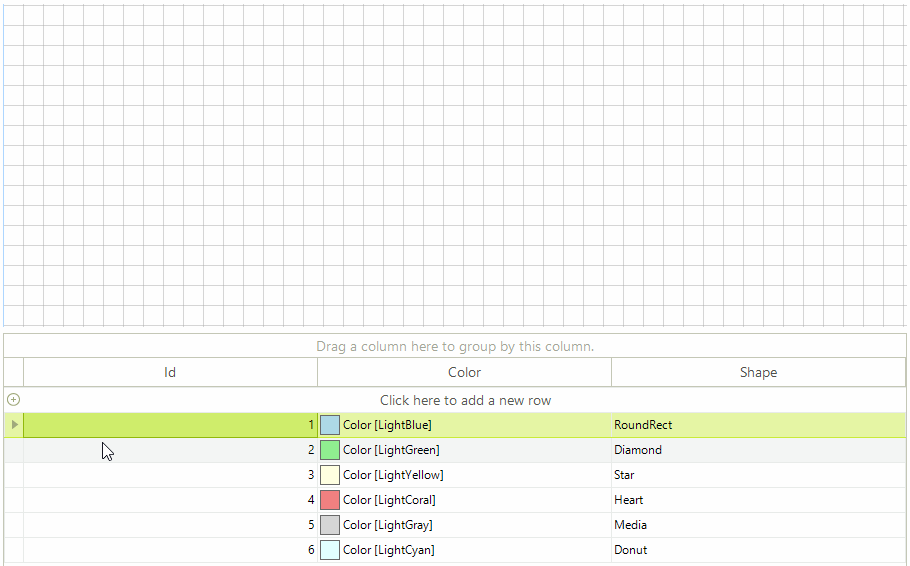

# Drag and Drop from Another Control

This article will demonstrate how you can create shapes in __RadDiagram__ after dragging an object from a separate control, in our case __RadGridView__.

>caption Figure 1: Grid to Diagram Drag and Drop

## Preparing RadGridView for Drag and Drop

The drag and drop behavior in __RadGridView__ is controlled by a service class. We are going to start this service when performing a mouse down operation on a certain row in the grid. In order to execute our custom logic we also need a custom row behavior  class responsible for handling the user actions. We can change the default row behavior and subscribe to the service events in the form`s constuctor.

#### Setup RadGridView

<snippet id='diagram-drag-and-drop-from-another-control-setupgrid-cs'/>
<snippet id='diagram-drag-and-drop-from-another-control-setupgrid-vb'/>

For the purpose of the example we will define a grid model object storing information about the shapes.

#### Grid Helpers

<snippet id='diagram-drag-and-drop-from-another-control-helperclasses-cs'/>
<snippet id='diagram-drag-and-drop-from-another-control-helperclasses-vb'/>

## Handling Events

__RadDiagram__ will accept the dragged data only if it is dropped on the diagram element. The __PreviewDragDrop__ event handler will be responsible for reading the data and transforming it to a shape.

#### Drag and Drop Events

<snippet id='diagram-drag-and-drop-from-another-control-handleevents-cs'/>
<snippet id='diagram-drag-and-drop-from-another-control-handleevents-vb'/>

# See Also

* [RadGridView]()
* [Populating with Data]()
* [Commands]() 
* [Diagram Events]()
* [Items Events]()
