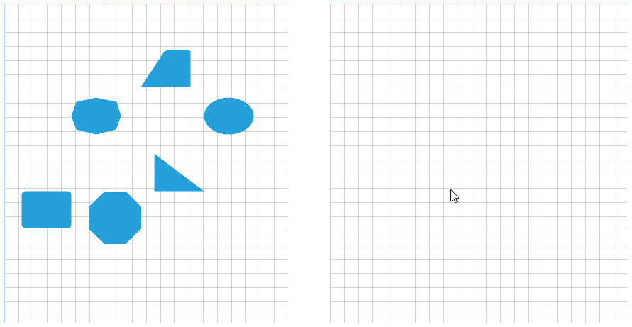

# OLE Drag and Drop

__RadDiagram__ is capable of performing drag and drop operation using the native OLE drag and drop support. The example below handles a scenario in which shape elments are being dragged from one diagram control and dropped onto another.

>caption Figure 1: Drag and Drop Between Two Diagrams 



In order to achieve the desired result the MouseDown, MouseMove and MouseUp events need to be handled in the first diagram. The drag operation will be started in the handler of the MouseMove event. The second diagram instance needs to be subscribed to the DragEnter and DragDrop events.

#### Subscribe to Events

{{source=..\SamplesCS\Diagram\OleDragAndDropForm.cs region=SubscribeEvents}} 
{{source=..\SamplesVB\Diagram\OleDragAndDropForm.vb region=SubscribeEvents}}
````C#
public OleDragAndDropForm()
{
    InitializeComponent();
    this.radDiagram2.AllowDrop = true;
    this.radDiagram1.IsDraggingEnabled = false;
    this.radDiagram1.MouseMove += radDiagram1_MouseMove;
    this.radDiagram1.MouseDown += radDiagram1_MouseDown;
    this.radDiagram1.MouseUp += radDiagram1_MouseUp;
    this.radDiagram2.DragEnter += radDiagram2_DragEnter;
    this.radDiagram2.DragDrop += radDiagram2_DragDrop;
}

````
````VB.NET
Public Sub New()
    InitializeComponent()
    Me.RadDiagram2.AllowDrop = True
    Me.RadDiagram1.IsDraggingEnabled = False
    AddHandler Me.RadDiagram1.MouseMove, AddressOf radDiagram1_MouseMove
    AddHandler Me.RadDiagram1.MouseDown, AddressOf radDiagram1_MouseDown
    AddHandler Me.RadDiagram1.MouseUp, AddressOf radDiagram1_MouseUp
    AddHandler Me.RadDiagram2.DragEnter, AddressOf radDiagram2_DragEnter
    AddHandler Me.RadDiagram2.DragDrop, AddressOf radDiagram2_DragDrop
End Sub

````


{{endregion}}

For the purpose of the example we will define a grid model object storing information about the shapes.

## Handling Events

__RadDiagram__ will accept the dragged data only if it is dropped on the diagram element. The __PreviewDragDrop__ event handler will be responsible for reading the data and transforming it to a shape.

#### Drag and Drop Events

{{source=..\SamplesCS\Diagram\OleDragAndDropForm.cs region=HandleEvents}} 
{{source=..\SamplesVB\Diagram\OleDragAndDropForm.vb region=HandleEvents}}
````C#
private void radDiagram2_DragDrop(object sender, DragEventArgs e)
{
    Telerik.WinControls.UI.RadDiagram diagram = sender as Telerik.WinControls.UI.RadDiagram;
    Point point = diagram.PointToClient(new Point(e.X, e.Y));
    RadDiagramShape draggedItem = e.Data.GetData(typeof(RadDiagramShape)) as RadDiagramShape;
    this.radDiagram1.RemoveShape(draggedItem);
    draggedItem.Position = point;
    diagram.AddShape(draggedItem);
    this.mouseDownPosition = Point.Empty;
}
private void radDiagram2_DragEnter(object sender, DragEventArgs e)
{
    e.Effect = DragDropEffects.Copy;
}
private Point mouseDownPosition;
private void radDiagram1_MouseDown(object sender, MouseEventArgs e)
{
    this.mouseDownPosition = e.Location;
}
private void radDiagram1_MouseUp(object sender, MouseEventArgs e)
{
    this.mouseDownPosition = Point.Empty;
}
private void radDiagram1_MouseMove(object sender, MouseEventArgs e)
{
    if (!(e.Button == MouseButtons.Left))
    {
        return;
    }
    if (this.ShouldBeginDrag(this.mouseDownPosition, e.Location))
    {
        RadDiagramShape draggedItem = this.radDiagram1.ElementTree.GetElementAtPoint(this.mouseDownPosition).Parent as RadDiagramShape;
        if (draggedItem != null)
        {
            ((Telerik.WinControls.UI.RadDiagram)sender).DoDragDrop(draggedItem, DragDropEffects.Copy);
        }
    }
}
private bool ShouldBeginDrag(Point current, Point capture)
{
    Size dragSize = SystemInformation.DragSize;
    Rectangle dragRect = new Rectangle(capture.X - dragSize.Width / 2,
        capture.Y - dragSize.Height / 2, dragSize.Width, dragSize.Height);
    return !dragRect.Contains(current);
}

````
````VB.NET
Private Sub radDiagram2_DragDrop(sender As Object, e As DragEventArgs)
    Dim diagram As Telerik.WinControls.UI.RadDiagram = TryCast(sender, Telerik.WinControls.UI.RadDiagram)
    Dim point As Point = diagram.PointToClient(New Point(e.X, e.Y))
    Dim draggedItem As RadDiagramShape = TryCast(e.Data.GetData(GetType(RadDiagramShape)), RadDiagramShape)
    Me.RadDiagram1.RemoveShape(draggedItem)
    draggedItem.Position = point
    diagram.AddShape(draggedItem)
    Me.mouseDownPosition = point.Empty
End Sub
Private Sub radDiagram2_DragEnter(sender As Object, e As DragEventArgs)
    e.Effect = DragDropEffects.Copy
End Sub
Private mouseDownPosition As Point
Private Sub radDiagram1_MouseDown(sender As Object, e As MouseEventArgs)
    Me.mouseDownPosition = e.Location
End Sub
Private Sub radDiagram1_MouseUp(sender As Object, e As MouseEventArgs)
    Me.mouseDownPosition = Point.Empty
End Sub
Private Sub radDiagram1_MouseMove(sender As Object, e As MouseEventArgs)
    If Not (e.Button = MouseButtons.Left) Then
        Return
    End If
    If Me.ShouldBeginDrag(Me.mouseDownPosition, e.Location) Then
        Dim draggedItem As RadDiagramShape = TryCast(Me.RadDiagram1.ElementTree.GetElementAtPoint(Me.mouseDownPosition).Parent, RadDiagramShape)
        If draggedItem IsNot Nothing Then
            DirectCast(sender, Telerik.WinControls.UI.RadDiagram).DoDragDrop(draggedItem, DragDropEffects.Copy)
        End If
    End If
End Sub
Private Function ShouldBeginDrag(current As Point, capture As Point) As Boolean
    Dim dragSize As Size = SystemInformation.DragSize
    Dim dragRect As New Rectangle(capture.X - dragSize.Width / 2, capture.Y - dragSize.Height / 2, dragSize.Width, dragSize.Height)
    Return Not dragRect.Contains(current)
End Function

````


{{endregion}}

# See Also

* [RadGridView]()
* [Populating with Data]()
* [Commands]() 
* [Diagram Events]()
* [Items Events]()
