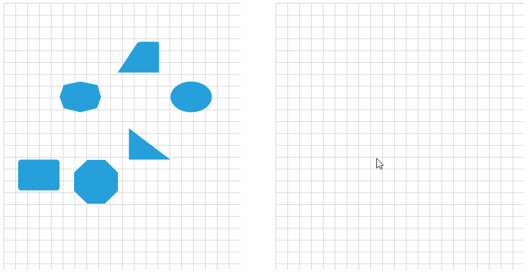

# OLE Drag and Drop

__RadDiagram__ is capable of performing drag and drop operation using the native OLE drag and drop support. The example below handles a scenario in which shape elments are being dragged from one diagram control and dropped onto another.

>caption Figure 1: Drag and Drop Between Two Diagrams 

In order to achieve the desired result the MouseDown, MouseMove and MouseUp events need to be handled in the first diagram. The drag operation will be started in the handler of the MouseMove event. The second diagram instance needs to be subscribed to the DragEnter and DragDrop events.

#### Subscribe to Events

<snippet id='diagram-ole-drag-and-drop-subscribeevents-cs'/>
<snippet id='diagram-ole-drag-and-drop-subscribeevents-vb'/>

For the purpose of the example we will define a grid model object storing information about the shapes.

## Handling Events

__RadDiagram__ will accept the dragged data only if it is dropped on the diagram element. The __PreviewDragDrop__ event handler will be responsible for reading the data and transforming it to a shape.

#### Drag and Drop Events

<snippet id='diagram-ole-drag-and-drop-handleevents-cs'/>
<snippet id='diagram-ole-drag-and-drop-handleevents-vb'/>

# See Also

* [RadGridView]()
* [Populating with Data]()
* [Commands]() 
* [Diagram Events]()
* [Items Events]()
